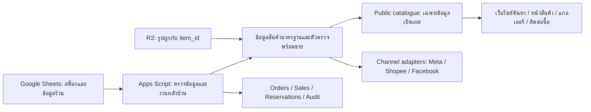

# OWARIN STORE — ภาพรวมไฟล์ ข้อมูลสด และแผนพัฒนาระบบ
ตรวจวันที่ 8 กันยายน 2026 · เวลาไทย · สถานะงาน: สำรวจและวางแผน ไม่แก้ข้อมูลร้านหรือ deploy

## ข้อสรุปสำหรับตัดสินใจ

ร้านมีฐานระบบพร้อมต่อยอดอยู่แล้ว: Google Sheets เก็บสต็อก, Apps Script เป็นหลังบ้านและเครื่องมือราคา, Cloudflare R2 เก็บรูป, มีทางออกไป Facebook Album, Meta Catalogue และ Shopee
ควรเริ่มจากทำ Product ID และข้อมูลขายให้เชื่อถือได้ แล้วใช้ข้อมูลชุดเดียวสร้างหน้าเว็บและข้อมูลสำหรับทุกช่องทาง
ยังไม่ควรใช้ไฟล์ส่งออกเดิมเป็นสต็อกปัจจุบัน หรืออัปโค้ดในเครื่องทั้งชุดโดยไม่เทียบกับ Apps Script ที่ใช้งานจริง

พบข้อมูลสินค้า 2,243 แถว / Product ID ไม่ซ้ำ 2,242 รหัส; Instock 1,077 แถว
ระบบปัจจุบันมีโครงสร้างสำหรับหนังสือและนิตยสาร แต่ยังไม่พบทะเบียนสต็อกโมเดลแยกชัดเจนในแหล่งที่ตรวจ
หมวด HOBBY MODEL และ HOBBY TOY AND MODEL ใน MAGAZINE เป็นข้อมูลในทะเบียนนิตยสาร จึงไม่ควรนับเป็นจำนวนโมเดลจริง

## 1. ขอบเขตและหลักฐาน

- สำรวจชื่อ ตำแหน่ง ขนาด และวันที่แก้ไขของไฟล์ใน workspace ทั้งหมดก่อนสร้างรายงาน: **11,358 ไฟล์ / 5,460,982,401 bytes (ประมาณ 5.09 GiB)**; รูป JPG/PNG 11,198 ไฟล์
- อ่านเอกสารหลัก โครงสร้างและส่วนสำคัญของ Apps Script/HTML/Python และข้อมูลรายงาน CSV; ไม่ได้เปิดดูรูป 11,198 ใบหรืออ่าน PDF/ไฟล์ไบนารีทุกไฟล์ และไม่เปิดเนื้อหาไฟล์ secret
- [Google Sheets หลัก OWARIN STORE](https://docs.google.com/spreadsheets/d/16TV5aA0iYMZQhDv34HFTkNOe0nBpk66pa4HC3wt98S0/edit): อ่าน metadata ทั้ง 12 แท็บและช่วงข้อมูลที่ระบุด้านล่าง พร้อมตรวจสูตรตัวอย่าง
- Drive search ยังพบ OWARIN STORE - BACK UP (2 ส.ค.), OWARIN STORE v2, OWARIN_GameGuide_Stock_v1 และไฟล์เติม platform/genre; ใช้ไฟล์หลักเป็นฐานของการตรวจครั้งนี้ ไม่รวมยอดจากไฟล์สำรอง
- ไม่ได้อ่าน source จาก Apps Script ที่ deploy, ตรวจสิทธิ์ deployment/trigger จริง, เปิด Seller Centre/Meta Commerce หรือทดสอบ HTTP ของรูปทุกใบ; สถานะ Facebook ด้านล่างมาจากบันทึกในชีต
- ไฟล์ประกอบ: [รายการไฟล์ทั้งหมด](FILE-INVENTORY-2026-09-08.json) และ [ปัญหาระบุชีต/แถว/รหัสสินค้า](AUDIT-ISSUES-2026-09-08.json)
- รายการปัญหา 848 แถวเป็นผลตรวจที่อาจซ้อนกันในสินค้าเดียว และรวมข้อมูลย้อนหลังที่ไม่ครบ ไม่ใช่ 848 สินค้าที่ระบบทำงานผิด

## 2. แผนที่ไฟล์ทั้งหมด

ขนาด MB ในตารางเป็น MiB โดยประมาณ; จำนวนไฟล์นับก่อนสร้างเอกสารชุดนี้

| ตำแหน่ง | ไฟล์ | MB | บทบาทและสิ่งที่ต้องทำต่อ |
|---|---:|---:|---|
| All Products | 3,715 | 1,773.98 | รูปต้นฉบับ/รูปจัดโพสต์; GGB-All 1,818, Magazine 846, Instock 01-09-2026 329, OLD - Preset 722 ไฟล์ |
| _r2_upload | 6,380 | 1,592.23 | รูปที่เตรียมส่งขึ้น R2, manifest, mapping และชุด _v3/_v4; ไม่ใช่สินค้าใหม่ 6,380 ชิ้น |
| _fb_albums | 857 | 268.01 | ชุดรูปสำหรับอัลบั้ม/งานเตรียม Facebook; ต้องเชื่อมกับ PID และสถานะล่าสุด |
| 03 Apps Script | 32 | 1.51 | หลังบ้าน, ราคา, Facebook automation, backup, spec และสคริปต์รูป |
| 04 Design Tools | 11 | 1.29 | Label, Watermark, Ad Cover, Arrival Card, Intro Card, logo/covers และ card test |
| 00 Docs | 6 | 0.17 | Handoff, review, แผน Facebook/Shopee และมาตรฐานภาพ; หลายข้อเก่ากว่าข้อมูลจริง |
| _exports | 10 | 3.36 | CSV ส่งออกและสำรองรอบก่อน; ชุดสต็อกล่าสุดบนดิสก์แก้ไข 1 ก.ย. ไม่ใช่ snapshot 8 ก.ย. |
| Shopee | 14 | 0.93 | Template, ตัวสร้าง mass upload, รายงานและผลลัพธ์เก่า |
| Facebook - Catalouge Project | 48 | 32.58 | feed และหลักฐานงานแค็ตตาล็อก; ไม่ควรใช้แทนข้อมูลหลัก |
| Facebook - Group | 4 | <0.01 | ข้อความประกาศขาย/ประมูลและโพสต์กลุ่ม |
| Supplier | 248 | 122.54 | ภาพ/ข้อมูลจากผู้ขายหลายราย; ยังไม่ใช่ทะเบียนรับซื้อที่เชื่อมต้นทุนรายชิ้น |
| GGB Online Files | 23 | 1,410.61 | PDF คู่มือ 20 ไฟล์ และไฟล์เกม ISO/BIN/CUE; แยกจากข้อมูลสินค้าหน้าร้าน |
| _archive | 8 | 0.78 | workbook/เครื่องมือเก่าและตำแหน่งเก็บ secret; ไม่รวมขึ้นเว็บหรือชุดเผยแพร่ |
| google sheet update.txt | 1 | <0.01 | ความต้องการปรับหลังบ้าน 5 ข้อ ดูหัวข้อ 6 |
| fix_r2_renamed_pids.ps1 | 1 | 0.01 | เครื่องมือซ่อม mapping รูปเมื่อ PID เปลี่ยน; การป้องกัน PID เปลี่ยนดีกว่าซ่อมซ้ำ |

ไม่พบ Git repository, appsscript.json, .clasp.json หรือ .openai/hosting.json ใน workspace ที่สำรวจ
ยังไม่มีหลักฐานว่าโฟลเดอร์นี้เป็น source deployment ที่ครบและตรงกับระบบใช้งานจริง

## 3. ภาพข้อมูล Google Sheets ปัจจุบัน

### สต็อก

นับแถวที่มีชื่อหรือ Product ID ตั้งแต่แถว 3; ไม่ใช้ grid rowCount เป็นจำนวนสินค้า

| สถานะ | GAME GUIDE BOOKS | MAGAZINE | รวม |
|---|---:|---:|---:|
| Instock | 507 | 570 | **1,077** |
| Sold | 439 | 266 | 705 |
| Auction | 405 | 0 | 405 |
| Hold | 2 | 1 | 3 |
| ว่าง | 53 | 0 | 53 |
| ทั้งหมด | **1,406** | **837** | **2,243** |

- Instock มี Price เป็นตัวเลขบวก 1,059 แถว; อีก **18 แถว** ไม่มีราคา อยู่ GAME GUIDE BOOKS แถว 1391–1408
- ผลรวม Price ที่กรอกของ Instock = **192,740 บาท** (GGB 131,510 / MAG 61,230); เป็นยอดรวมราคาที่ตั้ง ไม่ใช่ยอดขายหรือมูลค่าประเมินครบทั้งหมด เพราะขาดราคา 18 แถว
- ไม่มี Product ID ว่าง แต่มีรหัสซ้ำ **OWA-MAGM117VKAR01** ที่ MAGAZINE แถว **531 และ 532**: แถวหนึ่ง Instock ราคา 260 อีกแถว Sold ราคา 100
- สินค้า Sold ไม่มี Sold Date **674/705 แถว**: GGB 417 และ MAG 257; ไม่ควรเติมวันที่ปัจจุบันทับเป็นวันที่ขายย้อนหลัง
- Auction เป็นสถานะเดิมที่มีความหมายปะปนได้ระหว่างเข้าประมูลกับขายผ่านประมูลแล้ว ต้องนิยามก่อนแปลงข้อมูล

### หน้าที่ของ 12 แท็บ

| แท็บ | สิ่งที่ตรวจพบ | บทบาท |
|---|---|---|
| GAME GUIDE BOOKS | 1,406 แถวสินค้า | สต็อกบทสรุป รวม GAMEMAG SPECIAL/CHEATS/TOP SECRET และ POCKET BOOK |
| MAGAZINE | 837 แถวสินค้า | สต็อกนิตยสาร 12 Type |
| SALES | 19 แถวรายการที่มี Order/ชื่อสินค้า ในช่วง A2:I70 | บันทึกขาย มีช่อง Order ID, Item Name Sold, วันที่, ต้นทุน, ราคา, ค่าส่ง, กำไร, Note, PID |
| ALBUM CAPTION | 1,076 แถว | ข้อความและรูปสำหรับอัลบั้ม พร้อมสถานะการโพสต์ |
| FB ALBUMS | 20 แถวอัลบั้มที่อ่านจาก A2:H40 | Mapping Type → album_id, active และผลรันล่าสุด |
| TYPE LIST | 17 แถวใต้หัวตารางในช่วง A2:C60 | ชื่อ Type/อัลบั้ม |
| R2 IMAGES | PID จาก inventory 2,243 แถว; index 1,732 PID / 2,523 รูป | A:C สร้าง URL; E:F import จำนวนรูปจาก R2 |
| GAME INFO | 598 แถวที่คืนจาก A2:C1000 | Base Title, Synopsis, Series |
| FB CATALOGUE | 2,174 แถวในช่วงอ่าน; 2,136 แถวมี PID | ตารางประกอบข้อมูลก่อนสร้าง feed |
| META EXPORT | 770 แถว | Feed ที่สร้างไว้ก่อนหน้า |
| BOOKING | ตรวจหัวตารางและ C2:E308 | คิวลูกค้ารอสินค้า; ไม่ใช้ช่วง C:E นับลูกค้าทั้งหมด |
| TEMPLATES | 6 ชื่อเทมเพลตจาก A2:A315 | Invoice, Quotation และข้อความขาย/แจ้งสินค้า |

ช่วงหลักที่อ่าน: GGB A3:Z1437, MAG A3:W990, ALBUM A2:F1080, R2 A2:F2673, FB CATALOGUE A2:R2175, META A2:J1000
สูตรตัวอย่างที่ตรวจ: R2 A1:F3, GGB L3:W3, MAG J3:U3 และ FB CATALOGUE E2:H2

## 4. ปัญหาที่ควรจัดการก่อนเปิดเว็บไซต์

### P0 — Product ID และข้อมูลส่งออกไม่ตรงสต็อก

1. แก้ PID ซ้ำสองแถวโดยยืนยันว่าเป็นคนละชิ้นจริง แล้วทำตาราง alias ของ PID เก่า → ใหม่สำหรับรูปและช่องทางขาย; อย่าสร้างรหัสใหม่ทั้งร้าน
2. META EXPORT 770 แถวมี **15 แถวที่ PID พบแต่สถานะไม่ใช่ Instock**, **4 PID ที่ไม่พบใน inventory ปัจจุบัน**, และ **1 PID ที่ชี้หลายแถว**
3. เมื่อเทียบเฉพาะ PID ที่มีแถวเดียว พบราคาส่งออกต่างจาก Price ปัจจุบัน **16 แถว**; ในนี้ **12 แถวยังเป็น Instock**
4. META EXPORT ปัจจุบันไม่มี title/required field ว่างและรูปแบบราคา 770 แถวผ่านการตรวจข้อความ แต่ไม่ได้หมายความว่า feed สดหรือผ่านการตรวจของ Meta แล้ว
5. FB CATALOGUE มี **270 แถวที่มี PID แต่ title ว่าง** ซึ่งเชื่อมกับ Instock แบบ PID เดียวได้ทั้งหมด และคอลัมน์ G มีข้อความ THB ซ้ำ **767 แถว**
6. F2 ของ FB CATALOGUE ใช้ FILTER ตามลำดับแถวจาก inventory และขอบเขต GGB จบแถว 1322 ขณะที่ inventory มีข้อมูลถึงแถว 1408; ควรเปลี่ยนเป็น join ด้วย PID และเลิกใช้ขอบเขตตายตัว ไม่พึ่งว่าแต่ละคอลัมน์เรียงตรงกัน

เกณฑ์ผ่าน: PID ไม่ซ้ำ, publish validator คืนรายการผิดปกติพร้อมเหตุผล, feed ทุกแถวผูกกลับไปสินค้าเดียวที่ Instock และราคา/ชื่อ/รูปตรงกัน

### P0 — Facebook มีข้อผิดพลาดซ้ำในบันทึกล่าสุด

FB ALBUMS!H1 บันทึกรันล่าสุด **8 ก.ย. 2026 20:43**: Posted OK 0 / Errors 40
ALBUM CAPTION มี Posted 466, ว่าง 363, DUPLICATE 206, ERROR 41 รวม 1,076 แถว

- 40 แถวเป็น ERROR 100 อ้าง album_id **122195741756903319**: object ไม่มีอยู่, ไม่มีสิทธิ์อ่าน หรือไม่รองรับ operation ตามข้อความที่คืนมา
- อีก 1 แถวเป็น ERROR 324 รูปไม่ถูกต้อง/ไม่มีรูป
- ยังวินิจฉัยไม่ได้ว่าอัลบั้มถูกลบหรือ token/permission เปลี่ยนจากบันทึกเพียงอย่างเดียว
- ควรตรวจ ID/สิทธิ์ด้วยคำสั่งอ่านก่อน แล้วหยุด retry เฉพาะอัลบั้มที่เกิดข้อผิดพลาดเดิมซ้ำ; งานสำรวจนี้ไม่ได้เปลี่ยน active หรือ trigger
- ฝั่งโค้ดตรวจ Instock ก่อนโพสต์แล้ว แต่ข้อความ/ราคาที่สร้างไว้และโพสต์เก่าไม่มีระบบ reconcile ที่ยืนยันได้ครบ

### P1 — รูปยังไม่ใช่ทะเบียน asset ที่เชื่อถือได้ทุกชิ้น

Instock **24 แถว** ไม่พบใน index R2 E:F: 18 แถวสินค้าที่ไม่มีราคา, GGB อีก 4 แถว และ MAG อีก 2 แถว
นี่คือการไม่พบใน index ไม่ใช่ข้อพิสูจน์ว่าไม่มีไฟล์บน R2; 4 รายการเก่ามีลักษณะ PID เปลี่ยนและต้องตรวจ mapping

R2 IMAGES!A1 เก็บชื่อหัวตารางหลายช่องในเซลล์เดียวคั่นด้วย tab; B2/C2 สร้าง URL โดยต่อ /1.jpg และ /2.jpg
Code_v20.gs::_imageUrl ก็ hardcode /1.jpg ขณะที่ manifest _v4 บนดิสก์มี PNG **71 objects / 41 PID**
จำนวน PNG นี้ไม่ใช่จำนวนลิงก์เสียที่ยืนยันแล้ว แต่เพียงพอให้เปลี่ยนมาใช้ asset key จริงพร้อมนามสกุล
จำนวนรูปทั้งหมด 2,523 มาจาก live index; manifest _v4 มี 2,519 แถวและเป็นคนละ snapshot

### P1 — ประวัติขายยังใช้เป็นฐานรายงานทั้งร้านไม่ได้

SALES มี 19 แถว แต่สต็อก Sold มี 705 แถว จึงไม่ควรแสดงยอดใน SALES ว่าเป็นยอดขายย้อนหลังทั้งหมด
Mark Sold ในโค้ดเปลี่ยน inventory ก่อน แล้ว catch ความล้มเหลวการเขียน SALES เป็นค่า error ทำให้มีโอกาสขายสำเร็จแต่ ledger ไม่ครบ
Cart มี lock และตรวจของขายแล้ว แต่ยังเขียนหลายเซลล์/หลายแถวทีละขั้น ไม่มี transaction ข้ามชีตหรือ request ID กันการส่งซ้ำครบกระบวนการ

ควรบันทึกธุรกรรมก่อน/ระหว่างประมวลผลด้วยสถานะ pending/committed/failed, idempotency key และงานตรวจ inventory ↔ order items
แยกยอดลูกค้าจ่ายจริง, ส่วนลด, ค่าธรรมเนียม, ค่าส่งที่เก็บ, ค่าส่งที่ร้านจ่าย และราคาฐานที่ใช้เรียนรู้ราคา
ปัจจุบันค่าธรรมเนียม Shopee 0.30 เป็นค่าคงที่ในโค้ด ไม่ใช่อัตราปัจจุบันที่ยืนยันจากบัญชีร้าน

### P1 — ต้องยืนยันชุด source ที่ deploy ก่อนแก้ระบบจริง

| ไฟล์ | บรรทัด | สิ่งสำคัญ |
|---|---:|---|
| Web App/Code.gs | 3,845 | โค้ดหลักอีกชุด; _metaInScope ยังตัด MAGAZINE |
| Web App/Code_v20.gs | 3,275 | รองรับ MAGAZINE ใน Meta และมีแนวทางคง PID เดิมใน regenerateAllSKUs |
| Web App/WebApp.gs | 863 | API ของ Inventory, Sales, Booking, Contents, Tools |
| Web App/WebApp_v20.gs | 863 | API อีกชุด; ชื่อฟังก์ชันทับกับ WebApp.gs |
| Web App/Index.html | 1,969 | UI หลังบ้าน 7 แท็บ |
| FbAlbum.gs | 449 | Queue, dedupe, retry, trigger Facebook |
| RESTORE_Code.gs | 3,287 | ชุดกู้คืน ไม่ควรโหลดพร้อม Code หลัก |

FbAlbum.gs เรียก **_fbaOriginalIndex()** แต่ค้นในไฟล์ .gs ทั้งโฟลเดอร์แล้วไม่พบ definition
ในชีตมีผลรันจากระบบจริงอยู่ จึงยิ่งต้องเทียบ source บน Apps Script: ชุดในเครื่องอาจไม่ครบหรือคนละเวอร์ชัน
อย่าอัปไฟล์ Code/Code_v20/RESTORE หรือ WebApp/WebApp_v20 พร้อมกัน เพราะมี globals/functions ชื่อซ้ำ

API ที่อ่านในเครื่องยังไม่มีการตรวจตัวตน/บทบาทใน api()/_route(); ยังไม่ทราบสิทธิ์ deployment จริง จึงยังสรุปไม่ได้ว่าบุคคลภายนอกเข้าถึงได้
ก่อนเปิดเว็บสาธารณะ แยก endpoint อ่านแค็ตตาล็อกจากคำสั่งแก้สต็อกและข้อมูลลูกค้า โดยตรวจ access/executeAs จริงตาม [เอกสาร Web Apps ของ Google](https://developers.google.cn/apps-script/guides/web?hl=en)

## 5. สิ่งที่เอกสารเก่าบอกไม่ตรงหลักฐานปัจจุบัน

- REVIEW-2026-09-05 ระบุเองว่าไม่ได้อ่านชีตสด; ตัวเลขในไฟล์นั้นควรใช้เป็นประวัติ
- ข้อความว่า MAGAZINE ยังใช้สูตรตั้งราคาเก่าไม่สอดคล้องกับ _calcSuggestedPrice ใน Code.gs/Code_v20.gs ซึ่งเรียก engine ร่วมกัน และ live sheet มี Price Range/Max G Ref แบบ EXACT/SERIES/PUB/REVIEW อยู่แล้ว; ยังไม่ได้ยืนยันเวอร์ชัน deployed
- README บอก Meta เฉพาะ POCKET BOOK แต่ Code_v20.gs รวมหนังสือและนิตยสาร และ META EXPORT สดมีข้อมูลทั้งสองประเภท
- README/overview บางส่วนบอก consolidation เสร็จหรือยังมี 5–7 แท็บ; ปัจจุบันมี 12 แท็บ และชื่อ SALES/TEMPLATES ถูกใช้งานแล้ว จึงควรยึด schema ปัจจุบัน
- prepare_r2_upload.py ยังชี้ GGB All/GGB - POCKET BOOK ซึ่งไม่มีแล้ว; โค้ดมีการหยุดพร้อมข้อความเมื่อไม่พบโฟลเดอร์ ไม่ใช่พังเงียบตาม review เก่า
- ตัวเลข Facebook 108 รูป/ERROR 1 และรูปขาด 2 รายการเป็นข้อมูลรอบก่อน ไม่ใช่สถานะ 8 ก.ย.
- ไม่ได้ตรวจว่าไฟล์ Shopee ถูกอัปหรือเผยแพร่ไปแล้วจริงหรือไม่; ยืนยันเฉพาะผลลัพธ์ในเครื่อง **447 listings / 934 variation rows / held back 140 / missing images 2** ณ รอบสร้างเดิม

## 6. เทียบความต้องการใน google sheet update.txt

| ความต้องการ | หลักฐานในโค้ดปัจจุบัน | งานที่ควรทำ |
|---|---|---|
| ALL รวม Guide Book + Magazine | มีปุ่มเลือก GGB/MAG; ALL เป็นตัวกรองสถานะ | เพิ่ม source=ALL รวมข้อมูลสองประเภท; เก็บ source และ PID รายแถวให้ edit/cart ถูกชีต; เผื่อ MODEL |
| SALES บอกเล่ม/วัน/ราคาที่ขาย | มี sales.list ส่ง product/orderDate/price แต่ UI หลักสรุปยอดรายเดือน | เพิ่มตารางรายการขาย ค้นหา/กรองเดือน/ช่องทาง/ประเภท เปิด order detail; บอกขอบเขตประวัติที่บันทึก |
| Mark Sold รองรับ auction และราคาแยกเล่ม | รับราคาทีละชิ้นใน cart แล้ว แต่ยืนยันขายเป็น Sold และใช้ channel ระดับคำสั่ง | แยก sale_method=auction/direct, channel และราคาปิดจริงต่อ order item; นิยามข้อมูล Auction เดิมก่อน migrate |
| Add แล้วล้างทุกช่อง | ล้างชื่อ/ราคา/genre/platform/type/flags แต่ตั้งใจเก็บ publisher/condition/cost | เปลี่ยน default เป็น reset ทั้งฟอร์มและ auto-suggestion state; ถ้าต้องการ batch mode ให้เป็นตัวเลือกชัดเจน |
| Price Quotation เรียงชื่อ A–Z | buildItemsLines() ใช้ S.cart.map ตามลำดับเพิ่ม | ใช้สำเนาตะกร้าเรียงชื่อแบบ natural sort ก่อนสร้างข้อความ พร้อมตัวตัดสินลำดับด้วย PID |

ข้อที่ควรเก็บในงาน UI รอบเดียวกัน: Index.html ยังเดา flags เป็น POSTER/FC ขณะที่เอกสารใหม่ใช้ MAP/COLOUR; ต้องกำหนด enum เดียวและแปลงค่าเก่าอย่างมี mapping

## 7. โครงสร้างที่แนะนำสำหรับหนังสือ นิตยสาร และโมเดล

เริ่มด้วย adapter อ่านสองชีตเดิมเป็น schema กลางก่อน ไม่จำเป็นต้องยุบชีตและเปลี่ยน UI พร้อมกัน

| ข้อมูล | คีย์และข้อมูลที่ควรมี |
|---|---|
| Product / Edition | product_id คงที่, category=guide_book/magazine/model, title, series/franchise, publisher/brand |
| Inventory Item | item_id คงที่สำหรับของจริงแต่ละชิ้น, product_id, SKU แสดงผล, condition, cost, asking_price, status, received_at, sold_at, ตำแหน่งเก็บ |
| Book details | platform, language, edition, copy_flags, original_price |
| Magazine details | magazine_title, issue_no, year, month, supplements |
| Model details | manufacturer, model_line, scale/grade, character, assembled/sealed, box_condition, completeness, defects |
| Image Asset | asset_id, item_id, object_key จริง, mime_type, sequence, is_cover, updated_at |
| Order / Order Item | order_id, item_id, วันที่ขาย, sale_method, channel, ราคาจริง/ส่วนลด/ต้นทุน ณ วันที่ขาย |
| Payment / Shipment | ยอดรับ, payment_status, shipping_collected, shipping_paid, carrier, tracking |
| Reservation | reservation_id, item_id หรือ product request, customer_id, สถานะ, หมดอายุเมื่อใด |
| Channel Listing | item_id, channel, listing_id/variation_id/photo_id, last_synced_at, ราคา/สถานะที่ส่งล่าสุด, error |
| Audit / Jobs | request_id, operation, actor, before/after หรือ diff, status, attempt, next_retry_at |

แยกสินค้าแต่ละฉบับออกจากของจริงแต่ละชิ้น เพราะ RESTOCK สภาพ/ราคา/รูปอาจต่างกัน; ไม่ใช้ชื่อหรือเลขแถวเป็นคีย์อ้างอิง
สำหรับโมเดล ต้องระบุแหล่งสต็อกจริงก่อนนำเข้าหรือประเมินจำนวน; ไม่ใช้สูตรสำนักพิมพ์/ราคาปกของหนังสือคำนวณราคาโมเดลโดยอัตโนมัติ
ตั้ง policy ว่าสถานะใดเผยแพร่ได้ โดย unknown/blank/Hold และรายการข้อมูลไม่ครบเข้าสู่คิวตรวจ ไม่เผยแพร่อัตโนมัติ

## 8. สถาปัตยกรรมต่อยอด

ระยะแรกเก็บ Sheets เป็นฐานหลักและ Apps Script เป็นหลังบ้านได้ โดยให้เว็บไซต์อ่านเฉพาะข้อมูลสาธารณะที่สร้างแล้ว ไม่ส่ง cost, profit, customer หรือคำสั่ง admin ไปกับ catalogue
ทำหน้าเว็บค้นหา/กรอง/รายละเอียด/รูป และปุ่มติดต่อพร้อม SKU ก่อนระบบชำระเงินออนไลน์; แสดงสถานะล่าสุดและยืนยันสินค้าอีกครั้งตอนรับคำสั่งซื้อ
เมื่อมี checkout พร้อมกันหลายคน/หลายช่องทาง ค่อยย้ายส่วน order และ reservation ไปฐานข้อมูลที่รองรับ transaction โดยเลือกแหล่งข้อมูลหลักให้ชัดเจน ไม่เปิดให้ Sheets กับฐานข้อมูลเขียนสต็อกแข่งกัน

แบ่งงาน Apps Script เป็น batch และ checkpoint เพราะ [Google ระบุ runtime จำกัด 6 นาทีต่อ execution และเกิน quota จะหยุดด้วย exception](https://developers.google.com/apps-script/guides/services/quotas?authuser=01&hl=en)
ก่อนใช้งานรูปบนเว็บจริงควรตั้ง custom domain สำหรับ R2; [Cloudflare ระบุ r2.dev สำหรับงาน non-production และมี rate limit](https://developers.cloudflare.com/r2/buckets/public-buckets/)

## 9. ลำดับงานพร้อมเกณฑ์ตรวจรับ

| ลำดับ | ชุดงาน | เกณฑ์ผ่าน |
|---|---|---|
| 1 | ยืนยัน deployed source + snapshot + จัด source ชุดเดียว | มี version/deployment/manifest ที่ตรวจย้อนกลับได้; helper ครบ; ไม่มีไฟล์หลักซ้ำ |
| 2 | แก้ PID ซ้ำ/alias, blank status, ราคา 18 แถว, mapping รูป 24 แถว | PID unique; unresolved items ถูกกักจาก feed; ไม่สร้างวันขายย้อนหลังขึ้นเอง |
| 3 | ซ่อม Facebook album mapping/permission และ pipeline Meta/Shopee | ตรวจอ่าน album ได้; feed join PID; ไม่มี out-of-stock/unknown/ambiguous ID; ราคาแถวที่เผยแพร่ตรงข้อมูลหลัก |
| 4 | ปรับ Apps Script และ UI ตาม 5 ข้อ | ALL รวมประเภท; รายการขายดูได้; auction รายชิ้น; Add reset; quotation เรียงชื่อ |
| 5 | เพิ่ม order ledger, idempotency และ inventory reconciliation | คำขอซ้ำไม่ขายซ้ำ; failure บางขั้นกู้คืนได้; trace จาก order → ชิ้นสินค้า → ช่องทางได้ |
| 6 | เพิ่ม Model schema + asset registry | นำเข้าจากข้อมูลจริงที่ระบุแล้ว; รูปผูกของแต่ละชิ้น; enum/category ไม่ปะปน |
| 7 | ทำเว็บไซต์ catalogue จากข้อมูลที่ผ่าน validation | มือถือใช้งานได้; ค้นหา/กรองทั้ง 3 ประเภท; sold/hold ไม่สั่งซื้อได้; public ไม่มีข้อมูลภายใน |
| 8 | เพิ่ม checkout/ชำระเงิน/จัดส่งเมื่อกระบวนการพร้อม | reservation หมดอายุได้; webhook ซ้ำไม่ตัดสต็อกซ้ำ; ยอดรับ/ค่าธรรมเนียม/คืนเงินตรวจย้อนกลับได้ |

งานทดสอบสำคัญสำหรับรอบพัฒนา: ขาย SKU ซ้ำสองคำขอพร้อมกัน, ตะกร้ามี SKU ซ้ำ, ledger เขียนล้มเหลว, ราคาไม่ใช่ตัวเลข/ติดลบ, ฟอร์ม Add ต่อเนื่องสองประเภท, quotation ไทย/อังกฤษ/เลขเล่ม, รูป PNG/JPG, PID alias และ feed เทียบสต็อก
รอบสำรวจนี้ไม่รันคำสั่งขาย/เพิ่มสินค้า/โพสต์/อัปโหลด และไม่ทดสอบด้วยการแก้สต็อกจริง

## 10. สิ่งที่ทำเสร็จในรอบนี้

สร้างรายงานนี้, inventory ไฟล์ทั้งหมด และ issue list ระบุชีต/แถว เพื่อใช้ตั้งงานแก้ไขต่อได้โดยไม่ต้องสำรวจใหม่
บันทึกข้อแก้ความเข้าใจจากเอกสารเก่าไว้ในรายงาน และเพิ่มลิงก์อ้างอิงใน HANDOFF
สิ่งที่ยังต้องได้ในรอบ implementation: source deployment จริง, ความหมาย Auction ของข้อมูลเดิม, แหล่งทะเบียนโมเดล และตัวเลขค่าธรรมเนียมจริงจากบัญชีร้าน

