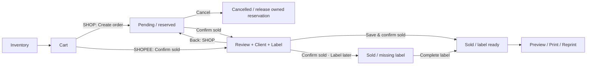

# OWARIN — Add Item / Cart / Orders / Label: implementation plan

วันที่ 2026-09-28 · Stream B · สถานะ: **ออกแบบเพื่อส่งต่อ ยังไม่ได้แก้ source หรือ deploy**

P1 board update 2026-10-03 Session33: focused rereview found R1 replay provenance/UI-cache and R3 status-type defects; targeted repair + red→green VM regressions **DONE**. Actual isolated Google R1–R4 failure/retry **PASS** at 16:20:32–16:20:43; fresh exports 29,576/30,982 bytes, only GGB27–29/journal80–87 (158 added cells), all prior cells unchanged. Helper removed; saved source reload/readback **PASS**. Exact revised candidate Code `279140CB27CF...`, webapp `057840A5F2E9...`, Index `5ECE912BC9AE...`; evidence `04 Design Tools/logs/P1-20261003-02/review.md`, Change `P1-20261003-02` / Request `P1-R1-R4-REREVIEW-001`. Bounded R1–R4 acceptance **DONE**; shop promotion **NO-GO** pending separate current-source rebase/pairing and journal migration review. Test `/exec`, shop and Back House LAB unchanged.

## 1. ขอบเขตและข้อสรุป

ต่อยอดเว็บ OWARIN BACK-OFFICE เดิมและชีต OWARIN STORE เดิม ไม่ใช่โปรเจกต์ OWARIN Back House LAB ที่อยู่ข้างกัน ผู้ใช้ขอแผนก่อนและจะให้โมเดลอื่นลงมือ จึงไม่ถือเอกสารนี้เป็นคำสั่งเริ่มแก้หรือ deploy

- เว็บที่ผู้ใช้ยืนยันว่ามีปัญหา: https://script.google.com/macros/s/AKfycbwncq04Ab1-ZvB_Q293w49qctLABh_JLQ_vSCLdChlR/dev
- ชีตหลัก: https://docs.google.com/spreadsheets/d/16TV5aA0iYMZQhDv34HFTkNOe0nBpk66pa4HC3wt98S0/edit
- โฟลเดอร์งาน: `C:/Users/JIN/OneDrive/Desktop/etc/OWARIN/OWARIN STORE/OWARIN STORE`
- ผู้ใช้ยืนยัน: **Create order ต้องกันสินค้าไว้จน Cancel หรือ Confirm sold**
- ผู้ใช้ขอคำแนะนำเรื่องจังหวะบันทึกขาย: ข้อเสนอคือเปิดหน้าตรวจรายการ/Label ก่อน แล้ว commit ด้วย `Save & confirm sold` มีทางเลือก `Confirm sold • Label later` เมื่อยังไม่มีที่อยู่

### Requirement map

| ID | สิ่งที่ต้องได้ | รายละเอียดในแผน |
|---|---|---|
| R01 | Add item ต่อเนื่องแล้วล้างช่องได้ทุกครั้ง | §3 และ QA-A |
| R02 | ค่าเริ่มต้น New Arrival | §3; default ฝั่ง UI และ server ต้องตรงกัน |
| R03 | เปิด Label Tool จาก Google Sheets | §7; ใช้ renderer เดียวกับเว็บ |
| R04 | CAUTION สะกดถูกและเต็มแนวกรอบบน–ล่าง | §7; ไม่ยืดรูปผิดสัดส่วน |
| R05 | Add to cart ข้างราคา กดครั้งเดียว | §4 |
| R06 | Cart มีสี่คำสั่ง | §4; Shopee เปลี่ยน Create order เป็น Confirm sold |
| R07 | Orders เป็น Bento และแสดงรายการที่สร้างทั้งหมด | §5; Pending/Sold/Cancelled พร้อมตัวกรอง |
| R08 | Pending มี Cancel / Confirm sold | §5–6 |
| R09 | Cancel คืนสินค้าสู่สถานะเดิม | §6; ไม่ล้างประวัติและไม่ revert สินค้าที่ถูกแก้จากภายนอก |
| R10 | Confirm sold เข้าหน้า Label | §5; มีจุด commit ที่ชัดเจน |
| R11 | Suggestion ลูกค้าจากทุกช่องและบันทึกลูกค้าใหม่ | §8; ใช้ CLIENT เดิม |
| R12 | Facebook ใช้ค้นหา/ฐานข้อมูลเท่านั้น | §7–8; ไม่ส่ง field นี้ให้ renderer |
| R13 | Handbook / log / ลำดับโมเดล | เอกสาร HANDBOOK และ IMPLEMENTATION-LOG ที่อยู่ข้างไฟล์นี้ |
| R14 | ทุก update/แก้ไขต้องมีประวัติย้อนตรวจ รวม error/retry/recovery | §15; ผู้ใช้ย้ำโดยตรงหลังรับแผน |

## 2. หลักฐานที่ตรวจแล้วและข้อจำกัด

### 2.1 ตรวจจากเว็บและ Google Sheets จริงในวันที่ 2026-09-28

- เปิดเว็บตามลิงก์ผู้ใช้ อ่านหน้าคลัง กด `+` เปิด Add item พบ `STATUS = New Arrival` แล้วกด Close ไม่ได้ Save สินค้าทดสอบลงร้าน
- จึงยืนยันเฉพาะค่าเริ่มต้นตอนเปิดฟอร์ม ณ เวลาตรวจ ไม่ได้ยืนยันว่าการเพิ่มต่อเนื่องไม่มีบั๊ก และไม่ได้ยืนยัน deployed source ตรงกับ local ทุกบรรทัด
- อ่าน metadata และช่วงหัวตารางจริง: `CLIENT!A1:F1`, `SALES!A1:Z2`, `GAME GUIDE BOOKS!A1:AF2`, `MAGAZINE!A1:AD2`
- CLIENT มีหัว `Facebook Account`, `Name`, `Phone Number`, `Address`, `Post Code`, `Note`; ใช้แท็บนี้ต่อ ห้ามสร้าง CUSTOMERS ซ้ำตามแบบร่างเก่า
- SALES มี `Order ID`, `Item Name Sold`, `Order date`, `Cost`, `Price`, `Shipping Cost`, `Net Profit`, `Note`, `Product ID`; `G2` เป็น ARRAYFORMULA ต้องตรวจพื้นที่ spill ก่อนเขียน profit รายแถว
- metadata ที่อ่านยังไม่มี ORDERS / ORDER LINES / ORDER REQUESTS จึงเป็นโครงสร้างใหม่ที่เสนอ ไม่ใช่ระบบที่ติดตั้งแล้ว
- ไม่อ่านรายชื่อลูกค้าหรือที่อยู่จริงมาใส่เอกสาร ไม่อ้างยอดขาย/จำนวนสินค้าจาก export เก่า และยังไม่มี full export สำหรับ migration

### 2.2 จุดอ้างอิง source ในเครื่อง

พาธในตารางสัมพันธ์กับโฟลเดอร์งานด้านบน เลขบรรทัดเป็น baseline วันตรวจ ให้ค้นด้วยชื่อฟังก์ชันอีกครั้งก่อนแก้

| ไฟล์ / ตำแหน่ง | สิ่งที่พบ | ผลต่อแผน |
|---|---|---|
| `03 Apps Script/Web App/Index.html:884–1017` | fillForm/openAdd/handler mSave; openAdd และ success ใช้ New Arrival แล้ว | ไม่เติม reset ซ้ำโดยยังไม่ reproduce |
| `Index.html:974–1002` | cache/filter/render/result banner ทำก่อน reset | error ระหว่างแสดงผลหลัง server บันทึกแล้วอาจทำให้ไม่ถึง reset; เป็นสมมติฐานที่ต้องพิสูจน์ |
| `Index.html:1038` | attachSuggest รองรับ prefix/substring, ลูกศร, Enter, Escape | ต่อเป็น candidate objects ที่มี client_id โดยรักษาพฤติกรรมเดิม |
| `Index.html:760–836` | itemHtml + event delegation; Add to cart อยู่ในรายละเอียดที่ยุบ | ย้ายปุ่มไปข้างราคา ใช้ data-act เดิม |
| `Index.html:1510–1680` | Cart มี channel, ราคา, ข้อความ, Confirm Sold | คงการคำนวณ/ข้อความเดิมและเปลี่ยน workflow |
| `WebApp_v25.gs:172` / `Code_v27.gs:2041` | _apiInvAdd / addInventoryRow ยัง fallback Instock | normalize default เฉพาะ Add ทุก entry point เป็น New Arrival |
| `Code_v27.gs:223` | _tryWrite คืน false และเก็บ error แต่ไม่ throw | critical writes ต้องตรวจผล ห้ามตอบ success หลังเขียนบางช่องไม่ได้ |
| `WebApp_v25.gs:277,314,596` | single sold/cart sold มีหลายทางและไม่มี durable request ID | รวม shared transaction path ก่อนเพิ่ม Orders |
| `WebApp_v25.gs:567` | _nextOrderId หาเลขจาก SALES เท่านั้น | ต้องรวม ORDERS/คำขอที่จัดสรรเลขแล้ว มิฉะนั้น Pending ชนเลข |
| `WebApp_v25.gs:220` / `Index.html:358` | server สูตร Shopee กับคำอธิบาย UI ไม่ตรงกัน | ตรวจความหมายราคาก่อนแก้; ไม่คัดลอกสูตรเก่าไปใช้เงียบ ๆ |
| `03 Apps Script/Backoffice Update/SalesService.gs` | candidate มี journal, replay, validation | ศึกษาแนวทางและ tests; ไม่ยกมาทั้งไฟล์ เพราะราคา/ค่าส่ง/Runtime ต่างจากชุดหลัก |
| `03 Apps Script/Live Source/Current-2026-09-10/Index.html:969` | snapshot เก่าเคยตั้งใจคง publisher/condition/cost | เป็นประวัติ ไม่ใช่หลักฐานว่าเว็บปัจจุบันยังใช้โค้ดนี้ |
| `04 Design Tools/OWARIN — LABEL TOOL.html:87,136,390,415` | label 100×150 mm, footer padding .7mm 0, labelHTML/fitBox/fitItems | reuse layout และแก้ spacing เจาะจง |
| `04 Design Tools/CAUTION-V2.md` + caution-v2.png | มี asset แก้สะกดเดิมแล้ว; เปิดภาพตรวจในรอบนี้ | ตรวจอนุมัติหน้าตาก่อนใช้; ไม่ต้อง generate ใหม่โดยอัตโนมัติ |

README ระบุ `Code_v27.gs + WebApp_v25.gs` แต่ AGENTS กำหนดให้ version เป็นคู่เดียวกัน ต้อง reconcile baseline ก่อนบันทึกเวอร์ชันถัดไป ห้ามเดาว่าเลขตรงกันคือ deployed แล้ว

เอกสาร `ORDERS-CRM-LABEL-DESIGN.md` วันที่ 11 ก.ย. เป็น reference เท่านั้น: workflow ขายก่อนรับเงิน, payments, shipments และ CUSTOMERS ในนั้นไม่ใช่ scope ใหม่ของผู้ใช้ แผนนี้แทนเฉพาะ Add/Cart/Order/Client/Label; ไม่เพิ่มระบบรับเงิน/refund/tracking ในงานนี้

## 3. Add item: แก้ที่เหตุและทำซ้ำได้

### สิ่งที่ผู้ใช้ควรเห็น

1. เปิด `+ Add item` → ช่องสินค้าทั้งหมดว่าง, Status = New Arrival; คงเฉพาะแหล่ง GUIDE BOOKS/MAGAZINE ที่เลือก
2. กด Save → ป้องกันส่งซ้ำและแสดง Saving; อย่าให้สลับ source หรือแก้ payload ที่กำลังส่ง
3. server ยืนยันบันทึกครบ → reset ฟอร์มและ suggestion/auto-fill/timer, โฟกัส Name; แสดง SKU ของรายการที่เพิ่งเพิ่มใน success banner
4. validation/network/write failure → เก็บข้อมูลที่กรอกและแสดงเหตุผล ไม่ reset ใน finally แบบไม่แยกผล
5. server บันทึกแล้วแต่ refresh UI ล้มเหลว → บอก `Saved; refresh inventory` พร้อม SKU; ไม่รายงานว่าการบันทึกล้มเหลวและชวนกดสร้างใหม่

### วิธีวินิจฉัยก่อนแก้

- P0 เก็บ source ที่ Apps Script ใช้จริงและเทียบ hash กับ local; `/dev` อ่าน source ที่ Save แล้ว การ deploy `/exec` อย่างเดียวไม่ใช่คำตอบของปัญหานี้
- ใน test copy ทดลอง Add ต่อเนื่อง 20 รอบ สลับ source, suggestion, ชื่อ restock, ช่อง optional ว่าง, เปลี่ยนจาก Edit มา Add และปิด/เปิดฟอร์ม
- จับ exception ทั้ง server response และ success UI; ตรวจ callback ที่มาช้า, pending blur timeout และ suggestion ที่ยังเปิด
- หลักฐานแต่ละเคสต้องบอกว่าชีตบันทึกสำเร็จหรือยัง ก่อนสรุปว่า reset เสีย

### ขอบเขต patch

- ใช้ reset helper เดียวสำหรับเริ่ม Add และ success Add; ไม่เปลี่ยน default ของ Edit ให้ทับสถานะเก่า
- ยกการแสดง success banner/refresh ออกจากเส้นทางที่ทำให้ reset ถูกข้ามหลังยืนยัน save; บังคับ response มี committed item identity ก่อนถือว่า success
- ควบคุม async ด้วย form generation/request token หรือ disable form ระหว่าง save; response เก่าไม่ควรล้างฟอร์มรอบใหม่
- ฝั่ง API + core trim status และใช้ New Arrival เมื่อ absent/blank; ค่า explicit ที่อนุญาตต้องคงเดิม
- _tryWrite critical failure ต้องเป็น recoverable error ไม่ใช่ success; readback ชื่อ/ID/status และช่อง critical หลังบันทึก
- ถ้ามี timeout หลัง append ต้องตรวจ request_id เดิมก่อน append ซ้ำ; ใช้ journal แบบเดียวกับ mutation อื่นเฉพาะที่จำเป็น ไม่ retry การสร้างด้วย ID ใหม่อัตโนมัติ
- Reuse SKU/SP-2/RESTOCK pipeline และ booking banner; ไม่แก้สูตรราคาหรือ renumber PID ใน bug fix นี้

## 4. Inventory และ Cart ให้ compact

Inventory row: `ชื่อสินค้า                       ฿390  [Add to cart]` และ metadata อยู่บรรทัดถัดไปเหมือนภาพเดิม

- ปุ่มอยู่ในแถวที่ยังไม่ expand; stop propagation ของ click ใช้ event delegation เดิม
- เพิ่มแล้วแสดง `In cart ✓` และ disable การเพิ่มซ้ำ; หลังเอาออก/clear cart กลับเป็น Add to cart
- ใช้ identity สินค้ารายชิ้น ไม่รวมคนละ copy ที่ชื่อเหมือนกัน; ไม่มี SKU/identity, Sold/Auction หรือจองโดย order อื่นต้องเพิ่มไม่ได้
- Hold ไม่ใช่ Instock; New Arrival ไม่ถือว่าพร้อมขายโดยอัตโนมัติ ให้ promote เป็น Instock ก่อนขายตาม baseline ที่ตรวจยืนยันใน P0
- มือถือให้ปุ่มไม่ทับราคา/ชื่อ รองรับ keyboard focus และ accessible name ที่ระบุชื่อสินค้า

| Channel | คำสั่งที่เห็นใน Cart |
|---|---|
| SHOP / Facebook | Price notify · Quotation · **Create order** · Clear cart |
| SHOPEE | Price notify · Quotation · **Confirm sold** · Clear cart |

ใช้ primary action ตำแหน่งเดียวเปลี่ยนตาม Channel แทนการเพิ่มปุ่มที่ห้า รองรับข้อยกเว้น Shopee ที่ผู้ใช้ระบุไว้ การลบรายชิ้นและแก้ราคายังคงเป็น control ของแต่ละแถว

- Price notify/Quotation สร้างข้อความหรือ copy เท่านั้น ไม่ reserve และไม่ขาย ไม่ส่งข้อความหาลูกค้าอัตโนมัติ
- Create order สำเร็จจึง clear cart และไป Orders พร้อม highlight การ์ดใหม่; ถ้า fail คง cart
- Pending เก็บราคาที่ตรวจยืนยันตอนสร้างเป็น snapshot; ก่อนยืนยันขายต้องแสดงยอด snapshot ให้เห็น ห้ามเปลี่ยนตามราคาปัจจุบันแบบเงียบ ๆ
- เก็บราคาใน channel เดิมกับฐานที่ ledger ใช้แยกให้ชัด; ไม่ใช้ parseFloat กับข้อความผิดรูป เช่น `390abc`
- ค่าส่งลูกค้าและต้นทุนขนส่งเป็นคนละค่า ไม่แปลง blank เป็น 0 โดยปริยาย; ไม่ปรับ accounting policy ในงาน UI
- Clear cart มี confirmation เฉพาะเมื่อไม่ว่าง; ไม่ cancel order ที่สร้างไปแล้ว

## 5. จังหวะยืนยันขายและหน้า Orders

### เปรียบเทียบจุด commit

| แบบ | ข้อดี | ความเสี่ยง |
|---|---|---|
| กด Confirm sold บนการ์ดแล้วขายทันที | บันทึกการขายเร็ว ที่อยู่ไม่ขวาง | กดผิดแล้ว SOLD จริงทันที; ปิด Label ไม่ได้แปลว่า undo sale |
| **เปิด review/Label ก่อน แล้วกด Save & confirm sold** | เห็นรายการ/ยอด/ผู้รับก่อนเขียน; ปิดหน้าได้โดยไม่เกิด sale | ถ้าบังคับที่อยู่จะขวาง Shopee/ลูกค้ายังไม่ส่งที่อยู่ จึงต้องมี Label later |

**แนะนำแบบที่สอง**: Pending จองสินค้าไว้แล้ว จึงใช้หน้าสุดท้ายป้องกัน human error ได้โดยไม่เปิดช่องขายซ้ำ ไม่ต้องมี browser confirm ซ้อนอีกหลังปุ่ม final

SHOPEE ไป review โดยไม่สร้าง Pending order ที่ผู้ใช้ต้องจัดการ; ถ้าย้อนกลับให้กลับ Cart ฝั่ง server ตรวจ availability อีกครั้งเมื่อ final submit ไม่มีการกันสินค้าด้วยแค่เปิดหน้า review ของ Shopee และถ้าพบชน reservation ต้องแสดง order เจ้าของให้แก้สถานการณ์ก่อน ไม่ steal reservation

### Bento board

- หนึ่งการ์ดต่อหนึ่ง order ไม่ใช่หนึ่งการ์ดต่อเล่ม; CSS Grid ปกติ 1/2/3 columns ตามพื้นที่ ไม่เพิ่ม masonry library และไม่ reorder สวนลำดับ keyboard
- ส่วนหัว: Order ID, Pending/Sold/Cancelled, Channel, เวลาสร้าง และจำนวนสินค้า
- เนื้อหา: ชื่อรายการ 2–3 บรรทัดแรก พร้อม `+N items`, ยอดรวม; คลิกเพื่อดูรายละเอียดครบ
- Pending แสดง action เพียง `Cancel` และ `Confirm sold` ตามคำขอ
- Sold แสดง `Complete label` เมื่อยังไม่ครบ หรือ `Preview / Print label` เมื่อครบ; ไม่ใช้ปุ่ม Confirm sold ซ้ำ
- Cancelled เก็บไว้ในประวัติ ไม่มีปุ่มขายซ้ำทันที; ไม่ย้อน order เดิมให้ pending เพื่อหลบประวัติ
- ตัวกรอง All / Pending / Sold / Cancelled; เปิดมาที่ Pending เพื่อทำงานเร็ว แต่ All ต้องดูทุก order ที่สร้างได้ (pagination เมื่อจำเป็น)
- label readiness เป็น badge เสริม ไม่แทน order status; `Printed` ไม่เท่ากับ Shipped
- ไม่เพิ่ม Part paid/Awaiting payment/Refunded โดยไม่มีระบบ payments; Sold ไม่อ้างว่ารับเงินจริงแล้ว

### เปิดหน้าปิดการขาย

บนสุดเป็นรายการ/ราคา/Channel/ค่าส่งที่ยืนยัน แก้ลูกค้าและผู้รับด้านซ้าย Preview Label ด้านขวาบน desktop; มือถือเรียงเป็นแนวตั้ง

- Primary `Save & confirm sold`: ต้องมี label fields ครบและผ่าน validation แล้วเก็บ snapshot ร่วมกับคำขอขาย
- Secondary `Confirm sold • Label later`: ยืนยันการขายที่มีข้อมูลธุรกรรมครบโดยไม่บังคับที่อยู่; แสดง Missing label
- `Back`: ไม่ขายและไม่ปลด reservation ของ Pending
- ถ้ากรอกข้อมูลแล้วยังไม่ submit ให้เตือนก่อนปิด/ย้อนกลับเฉพาะเมื่อมี unsaved changes; ไม่เก็บที่อยู่ลูกค้าใน localStorage โดยปริยาย
- หลัง server รับคำขอแล้ว ห้ามตีความการปิดหน้า/timeout เป็น Cancel; กลับมาอ่าน request status หรือ retry ID เดิม
- หากขายสำเร็จแล้ว แต่ CRM sync/preview/print ล้มเหลว แสดง Sold พร้อมงานที่ต้อง retry; ไม่คืน stock และไม่เรียก sales.confirm อีก

## 6. Data contract และความปลอดภัยของสต็อก

### สถานะแยกคนละความหมาย

| ชั้น | ค่าหลัก | ความหมาย |
|---|---|---|
| Order business status | PENDING / SOLD / CANCELLED | สถานะการทำรายการกับลูกค้า |
| Inventory status | Instock / Hold / Sold และ legacy values | สถานะรายชิ้น; Hold ของ order ต้องมีเจ้าของ reservation |
| Mutation request state | PREPARED / APPLYING / DONE / NEEDS_REVIEW | ความคืบหน้าการเขียนหลายจุด ห้ามแสดง APPLYING เป็น order Pending |
| Label readiness | MISSING / READY | คำนวณจาก recipient snapshot ที่ validate แล้ว |

ข้อเสนอการ reserve: ใช้ **Hold ที่มี ownership ใน ORDER LINES** และเก็บ prior status ก่อนเปลี่ยน อย่าเพิ่ม Pending ลง dropdown inventory ให้ปนกับ order status ของใหม่ไม่ต้องมีตาราง reservations แยก

### โครงสร้างที่เสนอ — ต้อง dry-run ตรวจ schema ก่อนสร้าง

| ที่เก็บ | ฟิลด์สำคัญ |
|---|---|
| CLIENT เดิม | รักษา A:F ตามเดิม; เพิ่ม Client ID และ Updated At ท้ายตารางสำหรับ stable identity/revision |
| ORDERS ใหม่ | Order ID, Status, Channel, Created At, Sold At, Cancelled At, Client ID, Subtotal, Customer Shipping, Carrier Expense, Total, Recipient Snapshot, Revision, Last Request ID |
| ORDER LINES ใหม่ | Order ID, Line ID, Item UID, Source, SKU Snapshot, Title Snapshot, Condition Snapshot, Cost Snapshot, Entered Price, Ledger Price, Price Basis, Prior Status, Reservation State |
| ORDER REQUESTS ใหม่ หรือ journal ที่ตรวจว่ามีอยู่จริง | Request ID, Action, Payload Hash, Order ID, State, Payload/Before Snapshot, Progress, Result, Error, Created/Updated At |
| Inventory เดิม | เพิ่ม Item UID แบบ immutable เฉพาะ copy ที่เริ่มใช้ workflow; ไม่แก้ Product ID เดิมหรือ R2 paths |

Item UID จำเป็นเพราะ Product ID เปลี่ยนได้ตามชื่อ/condition/publisher และมี PID CHANGES อยู่แล้ว ก่อนออกแบบจริงตรวจว่ามี stable key ที่ reuse ได้หรือไม่ ถ้ามีใช้ของเดิม ไม่สร้างซ้ำ; ห้ามอาศัย row number เป็น identity

- migration UID/Client ID ต้องสร้างครั้งเดียว ตรวจ duplicate และบันทึก before→after; ทดสอบ sort แล้วยังอ้างอิงถูก
- ถ้าต้องค้นรายการเก่าที่ยังไม่มี UID ใช้ source+SKU แบบต้อง unique; จัดสรร UID ภายใต้ lock แล้วเก็บ journal ก่อน claim
- PENDING และ SOLD มี recipient snapshot แยกจาก CLIENT; การแก้ CLIENT ไม่ย้อนเปลี่ยน label/order เก่า
- CLIENT Note เป็น internal โดย default เพราะยังไม่ตรวจความหมายข้อมูลจริง; Delivery Note บน label เป็น field แยก ห้ามเอา Note มา print อัตโนมัติ
- ไม่ย้าย SALES เก่าเข้า ORDERS หรือสร้าง order history ปลอม รายการเก่ายังอยู่หน้า Sales

### Invariants ที่ต้องทดสอบ

1. หนึ่ง Item UID มี active reservation ได้ไม่เกินหนึ่ง order; Create order ตรวจทุกชิ้นก่อนเขียน ไม่รับ cart ที่มี UID ซ้ำ
2. สร้าง Pending แล้วไม่มี SALES rows, ไม่มี Sold Date และไม่เปลี่ยน Price/Cost ต้นทาง
3. Cancel Pending ปลดเฉพาะ claim ของ order นี้ แล้วคืน **prior status** ของแต่ละชิ้น ไม่ตั้งทั้งหมดเป็น Instock โดยไม่ตรวจ
4. หากสินค้าไม่อยู่ Hold ตามที่ระบบคาด/ถูกขายทางอื่น/UID หาไม่พบหรือซ้ำ ให้ conflict และ review; ห้าม overwite เพื่อให้ cancel ดูสำเร็จ
5. Cancel ซ้ำคืนผลเดิม; Cancel Sold ต้องถูกปฏิเสธใน workflow นี้ การคืนของ/ย้อนขายเป็นคนละงาน
6. Final confirm ทำให้หนึ่ง SALES line ต่อหนึ่ง order line เท่านั้น; retry และ double-click ไม่เพิ่ม sale/order/client ซ้ำ
7. ทุกทางขาย (cart, single Mark Sold, inventory.update status, direct helper ที่ client เรียกได้) ต้องผ่าน guard เดียว รวมถึงเมนู/trigger ที่แก้สถานะเกี่ยวข้อง
8. ห้ามมี status edit ที่ bypass reservation; audit direct sheet edits ก่อน confirm/cancel และ fail closed เมื่อข้อมูลเปลี่ยน
9. Lock ป้องกัน script executions ที่ใช้ lock เดียวกัน ไม่ได้กันคนพิมพ์ในชีตหรือระบบภายนอก; ตรวจ live readback/revision และกำหนดช่อง reservation/UID เป็น managed fields
10. ปุ่ม Print/Save label/แก้ CLIENT ห้ามเปลี่ยน stock หรือเพิ่ม SALES

### Request / retry แบบเล็กที่สุดที่กู้คืนได้

- client สร้าง request_id ต่อ intent และคงไว้เมื่อ timeout; retry ต้องใช้ payload เดิม, ID เดิม; payload ต่างแต่ ID เดิมต้อง reject
- server validation → script lock → ตรวจ request เดิม → re-read status/identity/revision → เขียน intent+snapshot ที่ durable → apply ทีละขั้นแบบ replay ได้ → readback → DONE → return canonical result
- lock ครอบช่วงเขียนเท่านั้น ไม่ครอบเวลามนุษย์กรอก Label; helper ชั้นในไม่ acquire lock ซ้ำ
- ก่อน PREPARED ล้มเหลว: ไม่มีผลธุรกิจ หลัง PREPARED ล้มเหลว: เก็บ progress/ownership ให้ replay ได้ ห้ามลบ journal หรือปล่อยขาย item เดียวกัน
- ถ้ามี partial SALES ต้องแยกจากรายการสมบูรณ์ในการรายงานจน reconcile; ไม่อ้างว่า Sheets หลาย setValue เป็น atomic transaction
- หลัง response สูญหายให้ query request status ก่อนทำใหม่; request ที่ DONE คืน result เดิมแม้ client timeout
- หากใช้ guard แบบ global pending เหมือน candidate รุ่นเก่า ให้ใช้เฉพาะ technical mutation ที่ยังไม่เสร็จ ไม่ใช่ทุก business Pending order; หลาย Pending orders ต้องอยู่พร้อมกันได้
- Order ID รักษารูป `OWA-YYYYMMDD-NN`; allocator ตรวจ ORDERS + SALES + journal intent ภายใต้ lock เดียว, timezone Asia/Bangkok และรองรับ NN เกิน 99
- critical _tryWrite ต้องตรวจ boolean และ throw เมื่อผิดพลาด พร้อมคง request ให้ recover; ไม่เปลี่ยน helper ทั้งโปรเจกต์โดยไร้ regression tests

### Reservation กับ Facebook / Shopee

Hold ช่วยให้ job ที่เลือกเฉพาะ Instock ไม่เลือกสินค้าจองใหม่ แต่ **ไม่ได้พิสูจน์ว่าประกาศเดิมหรือ Shopee stock ถูกปิดทันที** งานนี้ไม่รวมการเขียน Meta/Shopee API โดยอัตโนมัติ

P0 ต้อง trace `FbAlbum.gs`, catalogue/feed builders และเมนูขายที่ยัง bypass status guard; ใน UI แสดงข้อความสั้นเมื่อ relevant ว่า reservation เป็นของ back-office และ owner ต้องจัดการ listing ภายนอกตามขั้นตอนเดิม จนแผน sync แยกได้รับอนุมัติ ห้ามอ้างว่าป้องกัน oversell ข้าม marketplace ได้ครบแล้ว

## 7. Label Tool และ CAUTION

### รูปแบบ

- ใช้ `04 Design Tools/OWARIN — LABEL TOOL.html` เป็น reference ตัวจริง (เป็นไฟล์ HTML ไม่ใช่โฟลเดอร์)
- คง 100×150 mm, outer margin 3 mm, FROM, ชื่อผู้รับ, โทร, ที่อยู่, Delivery Note, postal boxes 5 ช่อง, Contents และ caution strip
- Printable payload allowlist เท่านั้น: senderName/senderPhone, recipientName/phone/address/postalCode/deliveryNote, itemTitles
- **ไม่ส่ง Facebook Account, internal CLIENT Note, ราคา, ต้นทุน หรือข้อมูลค้นหาไป renderer**; แค่ซ่อนด้วย CSS ไม่พอ
- แสดงข้อมูลเต็มใน editor; fitBox ต้องตรวจ overflow หลัง font/image พร้อม หากที่อยู่ยังไม่พอที่ minimum font ให้แจ้งแก้ไข ไม่ตัดทิ้งเงียบ ๆ
- Contents ใช้ natural sort และ `+N items` เมื่อจำเป็น พร้อมดูรายการครบในรายละเอียด order

### แก้ caution

ต้นฉบับในภาพใช้ `COUTION` ซึ่งผิด → `CAUTION` ส่วน English captions ใช้ `Keep dry`, `Open with care`, `Do not bend`, `Handle with care` ให้ consistent

asset `caution-v2.png` ที่มีอยู่แก้ข้อความเหล่านี้แล้วและมีญี่ปุ่น `注意 / 水濡れ注意 / 開封注意 / 折曲厳禁 / 取扱注意`; ตรวจภาพจริงที่ขนาดพิมพ์อีกครั้งก่อนใช้ เพราะ asset เป็นงานออกแบบใหม่เดิม ไม่ใช่ icon ต้นฉบับที่เหมือนทุก pixel

- แก้ `.footer` จาก `padding:0.7mm 0` เป็น 0; img block, width 100%, height auto; ลบ fixed height/min-height ที่ทำให้เกิด white band หากมีใน deployed version
- แยกว่าเป็น padding ใน DOM หรือขอบขาวฝังอยู่ใน bitmap; ถ้ารูปมีขอบฝัง ใช้ asset ที่ขอบถูกต้องก่อน ไม่ใช้ object-fit:cover ตัดข้อความ
- เต็มแนวกรอบ **ภายใน label** ทั้งด้านบนและล่าง ไม่ใช่บังคับพิมพ์ถึงขอบกระดาษและไม่ลบ margin 3 mm ของทั้ง label
- ทดสอบบน preview, print/PDF และเครื่องพิมพ์จริง; ห้ามยืดแนวตั้งให้ icon เสียสัดส่วน

### ใช้จาก Sheets และ web app

- เพิ่ม submenu ใน `onOpen()` เดิม: `📦 Inventory Tools → Labels → Open Label Tool` ไม่ประกาศ onOpen ตัวใหม่ทับของเดิม
- ถ้าเลือกแถวใน ORDERS ให้เปิด order นั้น; เลือกหลายแถว dedupe Order ID แล้ว preview ตามลำดับ; ไม่มี selection ที่ใช้ได้ให้แสดงค้นหา order/กรอก manual
- ใช้ HtmlService dialog กว้างพอสำหรับ form+preview; sidebar ใช้ค้นหาได้แต่ไม่บีบฉลากจนต้องย่อผิดขนาด
- ฝั่ง web ใช้ view/route Label เดียวกัน; share renderer ที่จำเป็นใน Apps Script HTML partial หรือ shared source ที่มี script sync ตรวจ hash ห้าม copy renderer สองชุดแล้วแก้แยก
- รักษา standalone tool ให้เปิดใช้งานได้; ไม่เพิ่ม bundler/framework เพื่อ sync asset เพียงหนึ่งชิ้น
- `Print / Save as PDF` ใช้ browser print ก่อน; ตรวจ iframe/popup ของ Apps Script จริง อนุญาต fallback เปิด print view ในแท็บใหม่ด้วย user click
- เปิด print dialog ไม่ถือว่าพิมพ์สำเร็จ; reprint ไม่สร้าง sale; งานนี้ไม่เชื่อมใบปะหน้าขนส่งแบบ prepaid

## 8. Client suggestion และการบันทึก

อ่าน CLIENT ผ่าน API เฉพาะผู้ใช้ back-office ที่มีสิทธิ์ อย่าเปิดชีต/endpoint เป็น public เพื่อแก้เรื่องค้นหาไม่ได้

### Search behavior

- พิมพ์ใน Name / Phone / Facebook Account / Address / Post Code / ช่องค้นหาลูกค้า ใช้ candidate set เดียวกัน; Note ใช้ค้นหาในหน้าภายในได้ แต่ไม่ใส่ใน printed payload
- normalize trim, Unicode, whitespace, case; โทรเทียบ digit string และรองรับ +66/0 แบบ Thai โดยไม่ทำลายข้อมูลต้นฉบับ; Post Code เป็น string
- rank exact phone/name/FB ก่อน prefix แล้ว substring; combine fields เพื่อแคบผลแต่ไม่ auto-select เมื่อมีคนชื่อซ้ำ
- ใช้ attachSuggest เดิมเป็นฐาน เพิ่ม object {id,label,searchText} เฉพาะจุดจำเป็น; keyboard และ mouse ต้องได้ client_id เดียวกัน ไม่ lookup กลับด้วยข้อความ label
- debounce ประมาณ 200 ms; คืนผลจำกัดประมาณ 8 รายการ; stale response ห้ามทับ query ใหม่
- แสดง Name · FB · โทรท้าย 4 หลัก · บางส่วนที่อยู่ช่วยแยกคน; เลือกแล้วจึงเติมข้อมูล ไม่เติมเองระหว่างพิมพ์
- ถ้าแก้ช่องของลูกค้าที่เลือกแล้ว ห้าม suggestion เลือกคนอื่นทับเอง; การเปลี่ยนลูกค้าต้องเลือกใหม่อย่างชัดเจน
- cache เฉพาะ session เมื่อเหมาะสมและ invalidate หลัง save; ไม่เพิ่ม fuzzy search library/embeddings/AI matching

### Save behavior

- ไม่พบลูกค้า: แสดง `New client — save to CLIENT` เป็นทางเลือกที่เห็นชัดและเปิดไว้; save เมื่อกด final action เท่านั้น ไม่เขียนทุก keystroke
- พบลูกค้า: default `This order only`; ตัวเลือก `Update saved client details` ต้องเลือกโดยตั้งใจ เพราะคนซื้อกับผู้รับอาจคนละคน
- ใช้ Client ID และ revision ตัดสิน update; ชื่อ/เบอร์/FB ซ้ำต้องเสนอให้เลือก ไม่ merge อัตโนมัติ
- ผู้ซื้อกับผู้รับแยกความหมาย: `Use different recipient` เปิดช่องผู้รับของ order; FB ยังเป็นของผู้ซื้อและไม่ตามไปฉลาก
- Client ใหม่บันทึกครั้งเดียวด้วย request key; network retry ไม่เพิ่มลูกค้าซ้ำ
- การ save CLIENT ล้มเหลวหลัง sale DONE ให้แสดง `Sale saved; client save needs retry`; retry เฉพาะ CLIENT และใช้ recipient snapshot ที่เก็บแล้วทำ label ต่อได้
- recipient snapshot/revision ต้องถูกเก็บใน durable intent ก่อนขาย เพื่อไม่ให้ข้อมูลที่กรอกหายถ้า step ถัดไปขัดข้อง
- validate server-side, HTML escape, ป้องกัน spreadsheet formula injection ของข้อความที่ขึ้นต้น =/+/-/@ ตามวิธีเขียนจริง; โทร/ไปรษณีย์เขียนเป็น text และคงเลขศูนย์นำหน้า
- ไม่ log เบอร์/ที่อยู่เต็มใน console, screenshot ตัวอย่าง หรือ handoff; ใช้ synthetic data ใน tests

## 9. API ที่เสนอ

รักษา envelope `{ok,data}` / `{ok:false,error}` เดิม เพิ่ม errorCode เฉพาะที่ UI ต้องแยก recovery; ชื่อด้านล่างเป็น contract ที่เสนอ ไม่ใช่ฟังก์ชันที่มีอยู่แล้ว

| Action | Input สำคัญ | Output / ผลข้างเคียง |
|---|---|---|
| inventory.add | requestId, source, fields | item ที่ readback แล้ว; default New Arrival |
| orders.create | requestId, channel=SHOP, lines, shipping | Pending order + reservation; ไม่มี sale |
| orders.list / orders.get | filter/cursor หรือ orderId | การ์ด/รายละเอียด + revision + label readiness |
| orders.cancel | requestId, orderId, expectedRevision | Cancelled + restored items หรือ conflict |
| orders.confirm | requestId, orderId หรือ Shopee cart, expectedRevision, recipient?, clientChoice | Sold + sale refs + label/client sync state |
| requests.get | requestId | สถานะเพื่อแก้ timeout; ไม่มี mutation |
| clients.search | query/fields | bounded candidate objects |
| labels.save | requestId, orderId, expectedRevision, recipient, clientChoice | snapshot ใหม่และ CRM result; ไม่ขายซ้ำ |
| labels.get | orderId(s) | printable allowlist จาก snapshot |

เปลี่ยน `sales.confirm` และ `inventory.markSold` เดิมให้ delegate ไป transaction service เดียวที่ผ่านการตรวจแล้ว หรือ retire เส้นทางที่ UI ไม่ใช้พร้อม compatibility decision; ห้ามเหลือ public bypass ที่เขียน Sold ได้ตรง ๆ

## 10. ลำดับทำงานและโมเดล

ยึด routing policy ผู้ใช้ 13 ก.ย. เป็นหลัก ชื่อโมเดลเป็นชื่อที่ app tools ของ session นี้ประกาศรองรับ ไม่ใช่ข้ออ้างว่าได้สลับโมเดลแล้ว แชตนี้ไม่มี control เปลี่ยนโมเดลตัวเอง; ผู้ใช้เลือกใน app ก่อนเริ่มแต่ละ phase ไม่สร้าง chat/agent เพิ่มโดยอัตโนมัติ

| Phase | โมเดล / effort | งานและ gate ส่งต่อ |
|---|---|---|
| P0 Baseline + contracts | **GPT-6 Astra / High** | deployed source, sheet/table/formula/status/price semantics, stable identity, reservation bypass, exact baseline + ตัดสินข้อค้าง |
| P1 Add item | **GPT-5.6 Sol / Medium** | reproduce ก่อนแก้, reset/default; tests success/error/stale callbacks; transaction/retry ส่วน append ใช้ High หากต้องแก้ |
| P2 Cart UX + caution | **GPT-5.6 Sol / Medium** | ปุ่มข้างราคา/สี่คำสั่ง/asset-spacing; ไม่มี logic ขายใหม่จน P3 ผ่าน |
| P3 Order/stock transaction | **GPT-5.6 Sol / High** | schema, reserve/cancel/confirm, IDs, journal/retry, all entry-point guards; failure/concurrency tests ต้องผ่าน |
| P4 Focused review | **GPT-6 Astra / High** | review diff P3 เฉพาะ money/stock/data integrity/security; findings ต้องมี location+repro แล้ว writer เดิมแก้ |
| P5 Orders/CRM/Label integration | **GPT-5.6 Sol / Medium** | Bento, candidate UI, shared renderer, Sheets menu; client-save dedupe/revision ที่ critical ให้ใช้ High |
| P6 Acceptance + release | **GPT-5.6 Sol / Medium** | staging E2E, print/PDF, regression, handbook update; ถ้า critical diff เปลี่ยนหลัง P4 ต้อง review เฉพาะส่วนอีกครั้งด้วย Astra/High |

P1–P6 ยังไม่เริ่ม; ไม่มีงาน parallel writer เปลี่ยนไฟล์เดียวกัน และไม่ทำ model council หากแก้ปัญหาที่ reproduce ได้ล้มเหลวสองแนวทางจึง escalate ตาม policy; ไม่ใช้ Max/Ultra เป็น default

แนวคิดการเลือก effort ตามความซับซ้อนสอดคล้องกับ [OpenAI model selection](https://developers.openai.com/api/docs/guides/model-selection); ตารางจัดคนทำข้างบนเป็นข้อเสนอเฉพาะโปรเจกต์ตามนโยบายผู้ใช้ ไม่ใช่ benchmark หรือคำรับประกันประหยัด quota

## 11. Acceptance gates

| Gate | ต้องพิสูจน์ |
|---|---|
| QA-A Add | เพิ่ม 20 รอบ; success reset ครบ, failure คงค่า, callback เก่าไม่ล้างรายการใหม่, timeout retry ไม่ append ซ้ำ, explicit status คงเดิม, omitted/blank = New Arrival |
| QA-B Cart | กดจาก collapsed row ได้ครั้งเดียว; ไม่ expand โดยไม่ตั้งใจ; in-cart state ถูก; 4 คำสั่งต่อ channel; Clear cart ไม่ cancel order |
| QA-C Reservation | 2 sessions แย่ง copy เดียวได้ผู้ชนะหนึ่ง; หลาย Pending อยู่ร่วมได้; ไม่เพิ่ม SALES; invalid cart ไม่เกิด partial order ที่อ้างว่าสำเร็จ |
| QA-D Cancel | คืน prior status เฉพาะ owner; retry no-op; manual edit/Sold/UID conflict ไม่ถูกทับ; Cancel Sold ถูกปฏิเสธ |
| QA-E Confirm | หนึ่ง ledger line ต่อ line; duplicate click/timeout/reload ได้ order เดิม; Shopee ไม่ต้อง Create order; ย้อน review ไม่มี sale |
| QA-F Failure | inject fail ทุก write boundary: intent, lines, Hold, ledger, Sold, order status, CRM, response; recovery ไม่สูญสินค้าหรือขายซ้ำและไม่ซ่อน partial error |
| QA-G Identity | sort, PID เปลี่ยน, source ต่างแต่ SKU คล้าย, duplicated UID/SKU, daily order counter >99 และข้ามเที่ยงคืน |
| QA-H CRM | ชื่อซ้ำ/เบอร์ซ้ำ/+66/ศูนย์นำหน้า/ภาษาไทย/ไม่พบ/new-client retry/revision conflict/คนซื้อไม่ใช่ผู้รับ/query เก่ามาช้า |
| QA-I Label | 100×150 mm, caution เต็มกรอบ, long Thai name/address ไม่ขาด, assets loaded, barcode ไม่ได้ร้องขอจึงไม่เพิ่ม, Facebook/internal note/ราคาไม่อยู่ใน printable DOM/PDF |
| QA-J Regression | SP-2, RESTOCK, R2, Meta catalogue tests เดิมไม่พัง; header-driven write และ array formula ไม่ถูกทับ; add-on ไม่มี helper ชน |
| QA-K Access | เปิดจากสิทธิ์ owner ได้, ผู้ไม่มีสิทธิ์อ่าน CLIENT/เรียก mutation ไม่ได้; ไม่มี secrets/PII ใน public route/log |
| QA-L Audit | ทุก mutation มี change/request ID และ before→after; success/failure/retry/recovery ค้นเชื่อมกันได้; log ไม่ทับประวัติ; จำลอง log-write failure แล้วไม่เกิด false success หรือ blind retry |

เขียน test ที่ใช้ฟังก์ชันจริงและจำลอง failure ด้วย state ที่ตรวจได้ ไม่ถือ regex ตรวจว่ามีคำว่า New Arrival เป็นหลักฐานจบ QA-A ใช้ Node assert/VM และ harness เดิม ไม่เพิ่ม test framework โดยไม่จำเป็น

## 12. สิ่งที่เสนอเพิ่มเพื่อใช้ง่าย

รวมในงานนี้: In cart feedback, badge Missing label, summary ก่อน commit, แยก buyer/recipient, focus กลับ Name หลัง Add, query stale protection, toast มี Order ID/SKU, filter Pending และเลือกพิมพ์หลาย order จาก Sheets

เลื่อนไว้: payment ledger, refund/return workflow, carrier/tracking API, automatic marketplace stock sync, auto-expire Pending, drag-and-drop Bento, fuzzy AI search, label ZIP redesign, framework migration ไม่มีความจำเป็นสำหรับคำขอรอบนี้

ไม่มี auto-expire จนเจ้าของกำหนดอายุจอง; แสดงเวลาจองให้ตัดสิน Cancel เอง การกันสินค้าใน back-office ไม่รับประกันการกันบน Shopee

## 13. สิ่งที่ผู้ลงมือต้อง resolve ก่อนเขียน critical code

1. export/read current Apps Script project จริง ยืนยัน deployed functions และ header contracts; ห้ามใช้ snapshot 10 ก.ย. ทับ v27
2. reconcile ความหมาย Shopee entered price / ledger price และ Shipping Cost กับสูตร SALES ที่มีอยู่; ไม่เปลี่ยน accounting policy จาก inference หากยังขัดกันให้ถามเจ้าของพร้อมตัวอย่างจำลอง
3. ตรวจ stable Item UID ที่อาจเพิ่มโดยงานอื่น และ actual statuses ที่ขายได้; Auction เป็นประวัติขายหรือสินค้าพร้อมขายต้องไม่เดาจาก UI เก่า
4. ตกลงและทดสอบ recovery ของ partial writes, manual sheet edits และ listing ภายนอก; ไม่มี blind rollback stock
5. แผน final review ก่อน commit เป็นคำแนะนำล่าสุด ยังไม่ใช่ข้อเท็จจริงว่าผู้ใช้อนุมัติ deployment

## 14. เอกสารส่งต่อและแหล่งอ้างอิง

- `HANDBOOK-ADD-CART-ORDERS-LABEL_2026-09-28.md`: ขั้นตอนทำงาน, user handbook เป้าหมาย, prompt ส่งต่อ, release/rollback
- `IMPLEMENTATION-LOG-ADD-CART-ORDERS-LABEL_2026-09-28.md`: หลักฐาน, decisions, status, hash baseline, log template
- `HANDOFF_2026-09-28.md`: เพิ่ม session นี้ต่อท้ายโดยคง Sheet/Facebook design session ก่อนหน้า
- `04 Design Tools/logs/add_cart_orders_label_plan_20260928.csv`: before→after ของเอกสารรอบนี้
- [Google: dialogs / sidebars](https://developers.google.com/apps-script/guides/dialogs): HtmlService dialog จากเมนู Sheets
- [Google: asynchronous server communication](https://developers.google.com/apps-script/guides/html/communication): callbacks อาจไม่ได้จบตามลำดับที่เรียก
- [Google: Lock Service](https://developers.google.com/apps-script/reference/lock): mutual exclusion สำหรับ script code
- [Google: HTML Service restrictions](https://developers.google.com/apps-script/guides/html/restrictions): ตรวจ print view ใน iframe จริง

Archive preflight: พบ reference เดิมยังถูกอ้างถึงและงานนี้ยังเป็น proposal จึงไม่ย้าย source/design เก่าให้ลิงก์พัง ใช้ข้อความ supersession ในเอกสารนี้แทน; ถ้า implementation ภายหลังแทนไฟล์จริง ต้องทำ reference search + dry-run + CSV ตาม AGENTS

## 15. Mandatory change / error / recovery logs — user requirement

ผู้ใช้ย้ำวันที่ 2026-09-28: ทุกครั้งที่ update หรือแก้ไขต้องมี log เพื่อย้อนหาสาเหตุเมื่อผิดพลาด ข้อนี้เป็น acceptance requirement ไม่ใช่งานเสริมที่ตัดทิ้งได้

### A. ประวัติการพัฒนาและติดตั้ง

- ก่อนแก้: ออก Change ID, ระบุเหตุผล/ขอบเขต, absolute paths, baseline commit/hash และ backup/diff ที่ใช้ย้อนตรวจจริง
- หลังแก้: บันทึก before→after, final revision, exact test commands/results, error ที่พบ, แนวทางที่ลองและผล, deployment version ถ้ามี และ recovery/rollback instructions
- ทุก fix/retry เป็นรายการใหม่เชื่อม Change ID เดิม ไม่เขียนทับ error เดิมให้หาย; อัปเดต IMPLEMENTATION-LOG, CSV และ HANDOFF ในรอบงานเดียวกัน
- ข้อมูลธุรกิจ migration ต้องมี dry-run และ snapshot ที่กู้คืนได้ในที่จำกัดสิทธิ์; hash อย่างเดียวตรวจเวอร์ชันได้แต่ใช้กู้ไฟล์ไม่ได้

### B. ประวัติการเปลี่ยนข้อมูลเมื่อระบบทำงาน

- ทุก API/menu mutation ที่อยู่ใน scope นี้: Add/Edit item, Create/Cancel/Confirm order, Save/Update client, Save label ต้องมี durable intent และผลลัพธ์ ไม่ใช้ console log เป็นหลักฐานเดียว
- ใช้ request journal เดิมสำหรับ progress/replay และ audit history แบบ append-only สำหรับเหตุการณ์; ถ้า journal ที่ติดตั้งเก็บ event history ครบอยู่แล้ว reuse ได้ มิฉะนั้นเพิ่มแท็บ `AUDIT LOG` แบบเรียบง่าย ไม่สร้างระบบ logging ภายนอก
- ข้อมูลขั้นต่ำ: Event ID, Timestamp พร้อม timezone, Change/Request ID, Attempt, Action, Actor (เมื่อทราบจริง), source UI/API/menu, app version, entity type/ID, changed fields, before/after หรือ restricted snapshot reference, outcome, error code/stage, recovery reference
- แยก STARTED / SUCCEEDED / FAILED / RECOVERED; retry request เดิมได้ attempt ใหม่ แต่ธุรกรรมต้องไม่ทำซ้ำ ผลแก้ไขเชื่อม event ก่อนหน้าด้วย ID
- failed operation บันทึกว่าจุดไหนเขียนแล้ว/ยังไม่เขียน ไม่แสดงแค่คำว่า failed; หลัง recovery ตรวจ readback และบันทึกสิ่งที่คืน/แก้จริง ไม่อ้างว่า rollback สำเร็จจากการกดปุ่ม
- ก่อนเริ่ม mutation เขียน durable intent ไม่ได้ → ไม่เริ่มเขียนข้อมูล; ถ้า outcome log ล้มเหลวหลังธุรกิจ commit แล้ว → คง journal/recovery state และแจ้ง partial reporting error ห้ามทำรายการธุรกิจซ้ำเพื่อให้ log ครบ
- log ที่เผยแพร่ใน docs/console mask โทร/ที่อยู่และไม่มี credentials; ค่าเต็มที่จำเป็นต่อ recovery เก็บใน restricted snapshot เท่านั้น อย่า duplicate CLIENT ทั้งแถวลง log ทุกครั้ง
- ใช้ Google Sheets filter ของ AUDIT LOG เพื่อค้น Request ID / Order ID / Item UID / Client ID / เวลาได้ก่อน ไม่เพิ่ม dashboard ใหม่โดยไม่จำเป็น
- direct Sheet edits ที่ข้าม app ไม่อยู่ใต้ request journal: P0 ต้องระบุจุดที่ควบคุมได้และข้อจำกัดของ trigger/version history; เมื่อค่าเก่าหรือผู้แก้ระบุไม่ได้ ให้บันทึก Unknown/External change detected ห้ามแต่ง before value หรืออ้างว่าเก็บได้ครบทุกการแก้ภายนอก
- ห้ามลบหรือแก้ย้อนหลังให้ error หาย และไม่ทำ auto-prune จนเจ้าของกำหนด retention; recovery ต้องตรวจ revision/ownership ปัจจุบันก่อนคืนค่า ไม่ replay snapshot ทับข้อมูลใหม่

### C. Definition of done

ทุก phase ต้องส่ง Change ID + diff/backup reference + tests + log location; งานข้อมูลต้องส่ง Request ID และ outcome/recovery evidence ด้วย ถ้ายังไม่มี log ให้ถือว่างานยังไม่เสร็จ เพิ่มการทดสอบ QA-L ใน P3/P4/P6; การเปลี่ยน docs รอบนี้มีบันทึกใน implementation log และ CSV แล้ว ส่วน runtime audit ยังต้องพัฒนา
