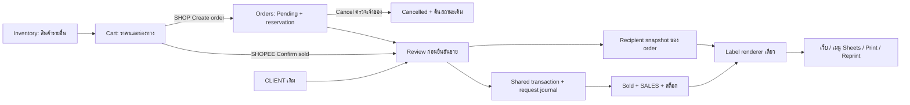
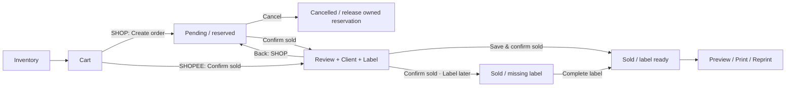

# OWARIN — Add Item / Cart / Orders / Label: implementation plan

จัดทำ: 2026-10-03 22:19:06 +0700 · Stream B §§2,5,6,9 · Session35 · Change `PLAN-20261003-01`

**P1 Add ติดตั้งแล้ว; งานที่เหลือจัดเป็น W1 → W2 → W3** ตามผลลัพธ์ที่ใช้งานได้ ตารางนี้เป็นแผนปัจจุบัน; รายละเอียดสัญญาระบบอยู่ §§3–9/11/15 ประวัติ P0–P6 เดิมยังอยู่ใน Implementation log ไม่ใช่คิวให้เริ่มใหม่

## 0. ภาพรวมและลำดับงานที่เหลือ

| ลำดับ / สถานะ | ผลลัพธ์ที่เจ้าของได้ | ขอบเขต / ของเดิมที่ใช้ต่อ | เกณฑ์จบ / ภาระงานสัมพัทธ์ |
|---|---|---|---|
| P1 — LIVE ตาม Session34 | Add ต่อเนื่อง, default New Arrival, บันทึกไม่ครบไม่ตอบ DONE, ตรวจคำขอเดิมได้ | Code/WebApp v31 + Index + P1Journal; ADD REQUESTS เท่านั้น | R1–R4 และ local/isolated Google tests ผ่าน; first real-shop Add ยังรอสังเกต ไม่มีงานแก้เพิ่มหากไม่พบบั๊ก |
| **1 - W1 CLOSED local/test; final focused review PASS** | **Cart → Create order → Pending → Cancel/Confirm sold** และ Orders Bento ใช้งานจบสาย | stable Item UID, shared guards, ORDERS/ORDER LINES/ORDER REQUESTS, SALES เดิม; ปุ่มข้างราคา + 4 คำสั่ง, final review + Label later | Exact v38; Session44 REVIEW.md/verification.json in W1-20261005-02; four candidate hashes/six source readbacks PASS; dated acceptance21groups + Google UI/replay/export preserved |
| **2 · W2 — implementation/retry/preview PASS; PDF/physical print DEFERRED — ยังไม่ได้ทดสอบ** | **ค้นหา/บันทึกลูกค้า → recipient → Label** จากเว็บและ Sheets; Print/Reprint gate ยังค้าง | Exact candidate v39; CLIENT ID/revision, committed snapshot, canonical renderer/CAUTION; current-writer focused review PASS | Package W2-20261005-01:14groups/6renderer checks/12source readbacks/6native replays; XLSX1,374,889bytes and PNG358,282bytes; ไม่มีขายซ้ำ; Owner2026-10-06 defer PDF/พิมพ์จริง: ยังไม่ได้ทดสอบ, ไม่ใช่ PASS; ทำ local/test readiness ต่อได้; W2-DEFER-20261006-01/READINESS.md |
| **3 · W3 — local migration/backend E2E PASS; native UI/migration OPEN; production TODO** | **เปิดใช้ workflow ครบชุดพร้อม undo และคู่มือ** | Session48 local13groups + fresh7native DONE replays/XLSX preservation; TEST-RUNBOOK.md; native UI/migration OPEN → release ที่อนุมัติ → readback | รวม QA-A–L ตามความเกี่ยวข้อง, ไม่มี critical issue ค้าง, source/schema/undo ตรงจริง; งานโค้ดต่ำแต่มีขั้น Google/เครื่องพิมพ์ |

W1/W2 ส่งมอบเป็นชุดสาธิตได้ในโปรเจกต์ทดสอบแยก ไม่ขึ้นร้านด้วยปุ่มที่ backend ยังไม่พร้อม; W3 เป็นจุดเปิดใช้ชุดใหม่ แผนไม่ได้ลดข้อกำหนดเพื่อให้จำนวนขั้นดูน้อยลง และไม่กำหนดชั่วโมง/เปอร์เซ็นต์ที่ยังไม่มีหลักฐานรองรับ

### โครงสร้างระบบปลายทาง

| ชั้นงาน | หน้าที่ / จุดแก้ที่คาด | ขอบเขตที่ทำให้เล็กและดูแลง่าย |
|---|---|---|
| หน้าจอ | `Index.html`: itemHtml, Cart, Orders grid, review, attachSuggest | ต่อ SPA เดิม ใช้ event delegation/CSS Grid ไม่เพิ่ม framework หรือหน้า back-office อีกชุด |
| API / ธุรกรรม | `WebApp_v31.gs` baseline: api, _apiInvUpdate, _apiMarkSold, _apiSalesConfirm, _nextOrderId; Code helpers/menu | Create/Cancel/Confirm ใช้ guard/lock/recovery ชุดเดียว; รวม caller ที่แก้ status ไม่ปล่อยช่อง bypass |
| ข้อมูล | Inventory = ตัวสินค้า; ORDERS = หัวรายการ; ORDER LINES = รายชิ้น/เจ้าของจอง; SALES = รายการขาย | SKU/row เปลี่ยนได้จึงไม่ใช่ identity ถาวร; ไม่ย้ายยอดขายเก่ามาสร้างประวัติ order ปลอม |
| กู้คืน / ตรวจย้อนหลัง | ADD REQUESTS สำหรับ P1; ORDER REQUESTS สำหรับธุรกรรมใหม่ | reuse รูปแบบ intent/progress/readback เฉพาะที่ใช้จริง; ใช้ journal เก็บ event ให้ครบก่อนพิจารณา AUDIT LOG แยก |
| ลูกค้า / ฉลาก | CLIENT + Client ID/revision; recipient snapshot แยกต่อ order; Label Tool เดิม | ไม่สร้าง CUSTOMERS ซ้ำ; ไม่ส่ง Facebook/internal note/ราคาให้ renderer; print ไม่ขายซ้ำ |

### คิวอื่นของร้าน — แยกจากเงื่อนไขจบ Add/Cart/Orders/Label

ข้อมูลส่วนนี้อ้าง STATE snapshot เดิม ไม่ใช่การตรวจระบบสดในรอบนี้: (1) รักษางานที่ LIVE; ถ้ามีข้อมูลเสีย/ขายซ้ำให้แก้ก่อน W1, (2) ตรวจผล Meta auto-refresh ที่ค้าง A5 และวินิจฉัย fbaPostBatch error ในงานบำรุงรักษาสั้น ไม่รื้อ pipeline, (3) Shopee relisting: ตรวจ builder/drafts และ mapping item IDs; reconciliation รายการเก่าต้องมี export ราคาสต็อก/options จากเจ้าของ, (4) OWA ads ยัง PARKED รอ budget/posts/break-even และคำสั่งเปิดงาน, (5) storefront/เครื่องมืออื่นสถานะยังไม่ตรวจจึงไม่รวมคำรับรองว่า “ทั้งร้านเสร็จ” ไม่แตะ OWARIN Back House LAB

**Next ONE step:** Fresh isolated two-channel UI E2E using newly scoped synthetic fixtures and original-ID recovery; export first, never rerun old Prepare/Repair. Native six-column migration fixture remains a separate untested gate. See `04 Design Tools/logs/W3-20261006-01/CONTINUE.md`; PDF/physical Print-Reprint remains owner-deferred and untested.

## 1. ขอบเขตและข้อสรุป

ต่อยอด OWARIN BACK-OFFICE และชีตเดิมใน `C:/Users/JIN/OneDrive/Desktop/etc/OWARIN/OWARIN STORE/OWARIN STORE`; ไม่เกี่ยวกับ sibling Back House LAB รอบ Session35 ปรับแผน/กฎ/เอกสารเท่านั้น ไม่แก้ runtime หรือ deploy

- เป้าหมายจบโครงการนี้: Add → Cart → Order/จอง/ยกเลิก/ขาย → Client/Label → พิมพ์จากเว็บและ Sheets พร้อม failure/retry ที่กู้คืนได้
- Pending ต้องกันสินค้า; Cancel ปลดเฉพาะจองของ order นี้; Auction ขายแล้ว/ห้ามขายซ้ำ; ขายได้เฉพาะ Instock
- SALES Shipping Cost = **Shipping Subsidy (ส่วนที่ร้านช่วยออก)**; Customer Shipping แยกต่างหาก ไม่ใช่ carrier expense
- ใช้ CLIENT เดิม; Facebook Account ใช้ค้นหา/เก็บข้อมูลเท่านั้น; final review ก่อน Save & confirm sold และมี Label later เป็นรูปแบบตามแผนสำหรับ acceptance
- การอนุมัติ production วันที่ 2026-10-03 ครอบคลุม P1 v31 ที่ติดตั้งแล้ว; release ใหม่ต้องตรวจขอบเขตการอนุมัติจริง ไม่ถามซ้ำในส่วนที่อนุมัติครบ และไม่ถือการปรับแผนเป็นคำสั่ง deploy

### Requirement map

| ID | สิ่งที่ต้องได้ | รายละเอียดในแผน |
|---|---|---|
| R01 | Add item ต่อเนื่องแล้วล้างช่องได้ทุกครั้ง | §3 และ QA-A |
| R02 | ค่าเริ่มต้น New Arrival | §3; default ฝั่ง UI และ server ต้องตรงกัน |
| R03 | เปิด Label Tool จาก Google Sheets | §7; ใช้ renderer เดียวกับเว็บ |
| R04 | CAUTION สะกดถูกและเต็มแนวกรอบบน–ล่าง | §7; ไม่ยืดรูปผิดสัดส่วน |
| R05 | Add to cart ข้างราคา กดครั้งเดียว | §4 |
| R06 | Cart มีสี่คำสั่ง | §4; Shopee เปลี่ยน Create order เป็น Confirm sold |
| R07 | Orders เป็น Bento และแสดงรายการที่สร้างทั้งหมด | §5; Pending/Sold/Cancelled พร้อมตัวกรอง |
| R08 | Pending มี Cancel / Confirm sold | §5–6 |
| R09 | Cancel คืนสินค้าสู่สถานะเดิม | §6; ไม่ล้างประวัติและไม่ revert สินค้าที่ถูกแก้จากภายนอก |
| R10 | Confirm sold เข้าหน้า Label | §5; มีจุด commit ที่ชัดเจน |
| R11 | Suggestion ลูกค้าจากทุกช่องและบันทึกลูกค้าใหม่ | §8; ใช้ CLIENT เดิม |
| R12 | Facebook ใช้ค้นหา/ฐานข้อมูลเท่านั้น | §7–8; ไม่ส่ง field นี้ให้ renderer |
| R13 | Handbook / log / ลำดับโมเดล | เอกสาร HANDBOOK และ IMPLEMENTATION-LOG ที่อยู่ข้างไฟล์นี้ |
| R14 | ทุก update/แก้ไขต้องมีประวัติย้อนตรวจ รวม error/retry/recovery | §15; ผู้ใช้ย้ำโดยตรงหลังรับแผน |

## 2. Baseline และหลักฐานที่ใช้ต่อ

สถานะร้านอ้าง **Session34 วันที่ 2026-10-03 21:56 +0700** จาก `04 Design Tools/logs/P1-20261003-03/result.md`, `source-readback.json`, `UNDO.md`; รอบนี้อ่านหลักฐานและ local source ไม่ตรวจร้านสดและไม่อ้างจำนวนสินค้า/ยอดขายปัจจุบัน

- Production project `1sxaS-J3YmCyJKX98HlrPvQH1uw9fRqITHEHN8_xGyJOKyuZchvAYhkkp`; Sheet `16TV5aA0iYMZQhDv34HFTkNOe0nBpk66pa4HC3wt98S0`; existing /exec Version4, owner-only; exact URL/hashes/rollback ใน result.md
- ชุดอ้างอิง local: `03 Apps Script/Web App/Code_v31.gs`, `WebApp_v31.gs`, `Index.html`, `P1Journal.gs`; v31 รักษา Meta v30. ไม่อัป whole-project bundle ทับ live FbAlbum/R2Upload ซึ่งต่างจากบาง local copies
- P1 R1–R4 frozen defect reproduction: `P1-20260930-11/review.md`; repaired local/Google evidence: `P1-20261003-02/review.md`; deployment/readiness และ backup: `P1-20261003-03/`. ใช้เป็นหลักฐานเดิม ไม่รัน reproduction ทั้งหมดซ้ำเมื่อไม่ได้แก้ Add
- CLIENT A:F เดิม = Facebook Account, Name, Phone Number, Address, Post Code, Note. SALES เดิมมี Order ID/ชื่อ/วันที่/Cost/Price/Shipping Cost/Net Profit/Note/Product ID; ต้องรักษา ARRAYFORMULA spill และ table/totals boundaries
- ORDERS/ORDER LINES/ORDER REQUESTS/Item UID/Client ID ตามแผนยังไม่ติดตั้ง; legacy Cart/Mark Sold ไม่ได้มีการคุ้มครองจาก ADD REQUESTS
- P0 source-traced ราคา Shopee ใช้ `round(enteredPrice*0.7-50)`; marketplace display formula `MAX(60,CEILING((Price+50)/0.7,10))`. เป็นสัญญาของโค้ดร้าน ไม่ใช่อัตราค่าธรรมเนียม Shopee ปัจจุบัน; ไม่เปลี่ยนสูตรในงานนี้
- Source risk ที่ W1 ต้อง reproduce/แก้: Auction/Hold bypass, duplicate cart lines, partial Sold/SALES, allocator อ่าน SALES อย่างเดียว, omitted subsidy แอบใช้ customer shipping. ฐานหลักฐาน `P1-20260930-08/integrity-review.md`; ไม่ใช่การทดลองขายจริงในร้าน
- แบบ `ORDERS-CRM-LABEL-DESIGN.md` 2026-09-11 และ phase P1–P6 ใน webapp-plan เก่าเป็นประวัติ; payments/shipments/CUSTOMERS ในนั้นไม่ใช่ขอบเขตนี้

## 3. Add item — LIVE; ตรวจซ้ำตามผลกระทบ

P1 v31 ผ่านการแก้ R1–R4 และ local/isolated runtime; production ผ่าน source/schema/readiness/modal smoke แต่ **first real production Add/DONE ยังไม่ทำ** และ real network outage/new-device auto-recovery ยังไม่พิสูจน์

- success reset ช่องสินค้า/default New Arrival/โฟกัส Name; error คง draft; callback เก่าห้ามล้างรายการใหม่; saved แล้ว refresh พังต้องบอก Saved ไม่ชวน Add ซ้ำ
- ตรวจ source/status/schema ก่อนเขียน, money/formula readback ก่อน DONE; replay คืน committed snapshot พร้อม provenance ไม่หยิบคนละชิ้นที่นำ SKU ไปใช้ใหม่
- timeout ใช้ Request ID เดิม/Check retry; ID หายให้ manual reconciliation แล้วหยุดเมื่อจับคู่ไม่ได้ ไม่สร้าง ID ใหม่เพื่อเดาว่ายังไม่บันทึก
- ห้ามเปิดงาน P1 ใหม่เพียงเพื่อทำ phase ให้ครบ; รัน QA-A เมื่อแก้ Add/Index ส่วนร่วม/helper/schema ที่เกี่ยวข้อง และใน release regression ตามความเสี่ยง ใช้ evidence เดิมของ 20-round/failure tests โดยไม่สร้างแถวร้านซ้ำ

## 4. Inventory และ Cart ให้ compact

Inventory row: `ชื่อสินค้า                       ฿390  [Add to cart]` และ metadata อยู่บรรทัดถัดไปเหมือนภาพเดิม

- ปุ่มอยู่ในแถวที่ยังไม่ expand; stop propagation ของ click ใช้ event delegation เดิม
- เพิ่มแล้วแสดง `In cart ✓` และ disable การเพิ่มซ้ำ; หลังเอาออก/clear cart กลับเป็น Add to cart
- ใช้ identity สินค้ารายชิ้น ไม่รวมคนละ copy ที่ชื่อเหมือนกัน; ไม่มี SKU/identity, Sold/Auction หรือจองโดย order อื่นต้องเพิ่มไม่ได้
- Hold ไม่ใช่ Instock; New Arrival ไม่ถือว่าพร้อมขายโดยอัตโนมัติ ให้ promote เป็น Instock ก่อนขายตาม baseline ที่ตรวจยืนยันใน P0
- มือถือให้ปุ่มไม่ทับราคา/ชื่อ รองรับ keyboard focus และ accessible name ที่ระบุชื่อสินค้า

| Channel | คำสั่งที่เห็นใน Cart |
|---|---|
| SHOP / Facebook | Price notify · Quotation · **Create order** · Clear cart |
| SHOPEE | Price notify · Quotation · **Confirm sold** · Clear cart |

ใช้ primary action ตำแหน่งเดียวเปลี่ยนตาม Channel แทนการเพิ่มปุ่มที่ห้า รองรับข้อยกเว้น Shopee ที่ผู้ใช้ระบุไว้ การลบรายชิ้นและแก้ราคายังคงเป็น control ของแต่ละแถว

- Price notify/Quotation สร้างข้อความหรือ copy เท่านั้น ไม่ reserve และไม่ขาย ไม่ส่งข้อความหาลูกค้าอัตโนมัติ
- Create order สำเร็จจึง clear cart และไป Orders พร้อม highlight การ์ดใหม่; ถ้า fail คง cart
- Pending เก็บราคาที่ตรวจยืนยันตอนสร้างเป็น snapshot; ก่อนยืนยันขายต้องแสดงยอด snapshot ให้เห็น ห้ามเปลี่ยนตามราคาปัจจุบันแบบเงียบ ๆ
- เก็บราคาใน channel เดิมกับฐานที่ ledger ใช้แยกให้ชัด; ไม่ใช้ parseFloat กับข้อความผิดรูป เช่น `390abc`
- ค่าส่งลูกค้าและต้นทุนขนส่งเป็นคนละค่า ไม่แปลง blank เป็น 0 โดยปริยาย; ไม่ปรับ accounting policy ในงาน UI
- Clear cart มี confirmation เฉพาะเมื่อไม่ว่าง; ไม่ cancel order ที่สร้างไปแล้ว

## 5. จังหวะยืนยันขายและหน้า Orders

### เปรียบเทียบจุด commit

| แบบ | ข้อดี | ความเสี่ยง |
|---|---|---|
| กด Confirm sold บนการ์ดแล้วขายทันที | บันทึกการขายเร็ว ที่อยู่ไม่ขวาง | กดผิดแล้ว SOLD จริงทันที; ปิด Label ไม่ได้แปลว่า undo sale |
| **เปิด review/Label ก่อน แล้วกด Save & confirm sold** | เห็นรายการ/ยอด/ผู้รับก่อนเขียน; ปิดหน้าได้โดยไม่เกิด sale | ถ้าบังคับที่อยู่จะขวาง Shopee/ลูกค้ายังไม่ส่งที่อยู่ จึงต้องมี Label later |

**แนะนำแบบที่สอง**: Pending จองสินค้าไว้แล้ว จึงใช้หน้าสุดท้ายป้องกัน human error ได้โดยไม่เปิดช่องขายซ้ำ ไม่ต้องมี browser confirm ซ้อนอีกหลังปุ่ม final

SHOPEE ไป review โดยไม่สร้าง Pending order ที่ผู้ใช้ต้องจัดการ; ถ้าย้อนกลับให้กลับ Cart ฝั่ง server ตรวจ availability อีกครั้งเมื่อ final submit ไม่มีการกันสินค้าด้วยแค่เปิดหน้า review ของ Shopee และถ้าพบชน reservation ต้องแสดง order เจ้าของให้แก้สถานการณ์ก่อน ไม่ steal reservation

### Bento board

- หนึ่งการ์ดต่อหนึ่ง order ไม่ใช่หนึ่งการ์ดต่อเล่ม; CSS Grid ปกติ 1/2/3 columns ตามพื้นที่ ไม่เพิ่ม masonry library และไม่ reorder สวนลำดับ keyboard
- ส่วนหัว: Order ID, Pending/Sold/Cancelled, Channel, เวลาสร้าง และจำนวนสินค้า
- เนื้อหา: ชื่อรายการ 2–3 บรรทัดแรก พร้อม `+N items`, ยอดรวม; คลิกเพื่อดูรายละเอียดครบ
- Pending แสดง action เพียง `Cancel` และ `Confirm sold` ตามคำขอ
- Sold แสดง `Complete label` เมื่อยังไม่ครบ หรือ `Preview / Print label` เมื่อครบ; ไม่ใช้ปุ่ม Confirm sold ซ้ำ
- Cancelled เก็บไว้ในประวัติ ไม่มีปุ่มขายซ้ำทันที; ไม่ย้อน order เดิมให้ pending เพื่อหลบประวัติ
- ตัวกรอง All / Pending / Sold / Cancelled; เปิดมาที่ Pending เพื่อทำงานเร็ว แต่ All ต้องดูทุก order ที่สร้างได้ (pagination เมื่อจำเป็น)
- label readiness เป็น badge เสริม ไม่แทน order status; `Printed` ไม่เท่ากับ Shipped
- ไม่เพิ่ม Part paid/Awaiting payment/Refunded โดยไม่มีระบบ payments; Sold ไม่อ้างว่ารับเงินจริงแล้ว

### เปิดหน้าปิดการขาย

บนสุดเป็นรายการ/ราคา/Channel/ค่าส่งที่ยืนยัน แก้ลูกค้าและผู้รับด้านซ้าย Preview Label ด้านขวาบน desktop; มือถือเรียงเป็นแนวตั้ง

- Primary `Save & confirm sold`: ต้องมี label fields ครบและผ่าน validation แล้วเก็บ snapshot ร่วมกับคำขอขาย
- Secondary `Confirm sold • Label later`: ยืนยันการขายที่มีข้อมูลธุรกรรมครบโดยไม่บังคับที่อยู่; แสดง Missing label
- `Back`: ไม่ขายและไม่ปลด reservation ของ Pending
- ถ้ากรอกข้อมูลแล้วยังไม่ submit ให้เตือนก่อนปิด/ย้อนกลับเฉพาะเมื่อมี unsaved changes; ไม่เก็บที่อยู่ลูกค้าใน localStorage โดยปริยาย
- หลัง server รับคำขอแล้ว ห้ามตีความการปิดหน้า/timeout เป็น Cancel; กลับมาอ่าน request status หรือ retry ID เดิม
- หากขายสำเร็จแล้ว แต่ CRM sync/preview/print ล้มเหลว แสดง Sold พร้อมงานที่ต้อง retry; ไม่คืน stock และไม่เรียก sales.confirm อีก

## 6. Data contract และความปลอดภัยของสต็อก

### สถานะแยกคนละความหมาย

| ชั้น | ค่าหลัก | ความหมาย |
|---|---|---|
| Order business status | PENDING / SOLD / CANCELLED | สถานะการทำรายการกับลูกค้า |
| Inventory status | Instock / Hold / Sold และ legacy values | สถานะรายชิ้น; Hold ของ order ต้องมีเจ้าของ reservation |
| Mutation request state | PREPARED / APPLYING / DONE / NEEDS_REVIEW | ความคืบหน้าการเขียนหลายจุด ห้ามแสดง APPLYING เป็น order Pending |
| Label readiness | MISSING / READY | คำนวณจาก recipient snapshot ที่ validate แล้ว |

ข้อเสนอการ reserve: ใช้ **Hold ที่มี ownership ใน ORDER LINES** และเก็บ prior status ก่อนเปลี่ยน อย่าเพิ่ม Pending ลง dropdown inventory ให้ปนกับ order status ของใหม่ไม่ต้องมีตาราง reservations แยก

### โครงสร้างที่เสนอ — ต้อง dry-run ตรวจ schema ก่อนสร้าง

| ที่เก็บ | ฟิลด์สำคัญ |
|---|---|
| CLIENT เดิม | รักษา A:F ตามเดิม; เพิ่ม Client ID และ Updated At ท้ายตารางสำหรับ stable identity/revision |
| ORDERS ใหม่ | Order ID, Status, Channel, Created At, Sold At, Cancelled At, Client ID, Subtotal, Customer Shipping, Shipping Subsidy, Total, Recipient Snapshot, Revision, Last Request ID |
| ORDER LINES ใหม่ | Order ID, Line ID, Item UID, Source, SKU Snapshot, Title Snapshot, Condition Snapshot, Cost Snapshot, Entered Price, Ledger Price, Price Basis, Prior Status, Reservation State |
| ORDER REQUESTS ใหม่ หรือ journal ที่ตรวจว่ามีอยู่จริง | Request ID, Action, Payload Hash, Order ID, State, Payload/Before Snapshot, Progress, Result, Error, Created/Updated At |
| Inventory เดิม | เพิ่ม Item UID แบบ immutable เฉพาะ copy ที่เริ่มใช้ workflow; ไม่แก้ Product ID เดิมหรือ R2 paths |

Item UID จำเป็นเพราะ Product ID เปลี่ยนได้ตามชื่อ/condition/publisher และมี PID CHANGES อยู่แล้ว ก่อนออกแบบจริงตรวจว่ามี stable key ที่ reuse ได้หรือไม่ ถ้ามีใช้ของเดิม ไม่สร้างซ้ำ; ห้ามอาศัย row number เป็น identity

- migration UID/Client ID ต้องสร้างครั้งเดียว ตรวจ duplicate และบันทึก before→after; ทดสอบ sort แล้วยังอ้างอิงถูก
- ถ้าต้องค้นรายการเก่าที่ยังไม่มี UID ใช้ source+SKU แบบต้อง unique; จัดสรร UID ภายใต้ lock แล้วเก็บ journal ก่อน claim
- PENDING และ SOLD มี recipient snapshot แยกจาก CLIENT; การแก้ CLIENT ไม่ย้อนเปลี่ยน label/order เก่า
- CLIENT Note เป็น internal โดย default เพราะยังไม่ตรวจความหมายข้อมูลจริง; Delivery Note บน label เป็น field แยก ห้ามเอา Note มา print อัตโนมัติ
- ไม่ย้าย SALES เก่าเข้า ORDERS หรือสร้าง order history ปลอม รายการเก่ายังอยู่หน้า Sales

### Invariants ที่ต้องทดสอบ

1. หนึ่ง Item UID มี active reservation ได้ไม่เกินหนึ่ง order; Create order ตรวจทุกชิ้นก่อนเขียน ไม่รับ cart ที่มี UID ซ้ำ
2. สร้าง Pending แล้วไม่มี SALES rows, ไม่มี Sold Date และไม่เปลี่ยน Price/Cost ต้นทาง
3. Cancel Pending ปลดเฉพาะ claim ของ order นี้ แล้วคืน **prior status** ของแต่ละชิ้น ไม่ตั้งทั้งหมดเป็น Instock โดยไม่ตรวจ
4. หากสินค้าไม่อยู่ Hold ตามที่ระบบคาด/ถูกขายทางอื่น/UID หาไม่พบหรือซ้ำ ให้ conflict และ review; ห้าม overwite เพื่อให้ cancel ดูสำเร็จ
5. Cancel ซ้ำคืนผลเดิม; Cancel Sold ต้องถูกปฏิเสธใน workflow นี้ การคืนของ/ย้อนขายเป็นคนละงาน
6. Final confirm ทำให้หนึ่ง SALES line ต่อหนึ่ง order line เท่านั้น; retry และ double-click ไม่เพิ่ม sale/order/client ซ้ำ
7. ทุกทางขาย (cart, single Mark Sold, inventory.update status, direct helper ที่ client เรียกได้) ต้องผ่าน guard เดียว รวมถึงเมนู/trigger ที่แก้สถานะเกี่ยวข้อง
8. ห้ามมี status edit ที่ bypass reservation; audit direct sheet edits ก่อน confirm/cancel และ fail closed เมื่อข้อมูลเปลี่ยน
9. Lock ป้องกัน script executions ที่ใช้ lock เดียวกัน ไม่ได้กันคนพิมพ์ในชีตหรือระบบภายนอก; ตรวจ live readback/revision และกำหนดช่อง reservation/UID เป็น managed fields
10. ปุ่ม Print/Save label/แก้ CLIENT ห้ามเปลี่ยน stock หรือเพิ่ม SALES

### Request / retry แบบเล็กที่สุดที่กู้คืนได้

- client สร้าง request_id ต่อ intent และคงไว้เมื่อ timeout; retry ต้องใช้ payload เดิม, ID เดิม; payload ต่างแต่ ID เดิมต้อง reject
- server validation → script lock → ตรวจ request เดิม → re-read status/identity/revision → เขียน intent+snapshot ที่ durable → apply ทีละขั้นแบบ replay ได้ → readback → DONE → return canonical result
- lock ครอบช่วงเขียนเท่านั้น ไม่ครอบเวลามนุษย์กรอก Label; helper ชั้นในไม่ acquire lock ซ้ำ
- ก่อน PREPARED ล้มเหลว: ไม่มีผลธุรกิจ หลัง PREPARED ล้มเหลว: เก็บ progress/ownership ให้ replay ได้ ห้ามลบ journal หรือปล่อยขาย item เดียวกัน
- ถ้ามี partial SALES ต้องแยกจากรายการสมบูรณ์ในการรายงานจน reconcile; ไม่อ้างว่า Sheets หลาย setValue เป็น atomic transaction
- หลัง response สูญหายให้ query request status ก่อนทำใหม่; request ที่ DONE คืน result เดิมแม้ client timeout
- หากใช้ guard แบบ global pending เหมือน candidate รุ่นเก่า ให้ใช้เฉพาะ technical mutation ที่ยังไม่เสร็จ ไม่ใช่ทุก business Pending order; หลาย Pending orders ต้องอยู่พร้อมกันได้
- Order ID รักษารูป `OWA-YYYYMMDD-NN`; allocator ตรวจ ORDERS + SALES + journal intent ภายใต้ lock เดียว, timezone Asia/Bangkok และรองรับ NN เกิน 99
- critical _tryWrite ต้องตรวจ boolean และ throw เมื่อผิดพลาด พร้อมคง request ให้ recover; ไม่เปลี่ยน helper ทั้งโปรเจกต์โดยไร้ regression tests

### Reservation กับ Facebook / Shopee

Hold ช่วยให้ job ที่เลือกเฉพาะ Instock ไม่เลือกสินค้าจองใหม่ แต่ **ไม่ได้พิสูจน์ว่าประกาศเดิมหรือ Shopee stock ถูกปิดทันที** งานนี้ไม่รวมการเขียน Meta/Shopee API โดยอัตโนมัติ

W1.1 ต้อง trace `FbAlbum.gs`, catalogue/feed builders และเมนูขายที่ยัง bypass status guard; ใน UI แสดงข้อความสั้นเมื่อ relevant ว่า reservation เป็นของ back-office และ owner ต้องจัดการ listing ภายนอกตามขั้นตอนเดิม จนแผน sync แยกได้รับอนุมัติ ห้ามอ้างว่าป้องกัน oversell ข้าม marketplace ได้ครบแล้ว

## 7. Label Tool และ CAUTION

### รูปแบบ

- ใช้ `04 Design Tools/OWARIN — LABEL TOOL.html` เป็น reference ตัวจริง (เป็นไฟล์ HTML ไม่ใช่โฟลเดอร์)
- คง 100×150 mm, outer margin 3 mm, FROM, ชื่อผู้รับ, โทร, ที่อยู่, Delivery Note, postal boxes 5 ช่อง, Contents และ caution strip
- Printable payload allowlist เท่านั้น: senderName/senderPhone, recipientName/phone/address/postalCode/deliveryNote, itemTitles
- **ไม่ส่ง Facebook Account, internal CLIENT Note, ราคา, ต้นทุน หรือข้อมูลค้นหาไป renderer**; แค่ซ่อนด้วย CSS ไม่พอ
- แสดงข้อมูลเต็มใน editor; fitBox ต้องตรวจ overflow หลัง font/image พร้อม หากที่อยู่ยังไม่พอที่ minimum font ให้แจ้งแก้ไข ไม่ตัดทิ้งเงียบ ๆ
- Contents ใช้ natural sort และ `+N items` เมื่อจำเป็น พร้อมดูรายการครบในรายละเอียด order

### แก้ caution

ต้นฉบับในภาพใช้ `COUTION` ซึ่งผิด → `CAUTION` ส่วน English captions ใช้ `Keep dry`, `Open with care`, `Do not bend`, `Handle with care` ให้ consistent

asset `caution-v2.png` ที่มีอยู่แก้ข้อความเหล่านี้แล้วและมีญี่ปุ่น `注意 / 水濡れ注意 / 開封注意 / 折曲厳禁 / 取扱注意`; ตรวจภาพจริงที่ขนาดพิมพ์อีกครั้งก่อนใช้ เพราะ asset เป็นงานออกแบบใหม่เดิม ไม่ใช่ icon ต้นฉบับที่เหมือนทุก pixel

- แก้ `.footer` จาก `padding:0.7mm 0` เป็น 0; img block, width 100%, height auto; ลบ fixed height/min-height ที่ทำให้เกิด white band หากมีใน deployed version
- แยกว่าเป็น padding ใน DOM หรือขอบขาวฝังอยู่ใน bitmap; ถ้ารูปมีขอบฝัง ใช้ asset ที่ขอบถูกต้องก่อน ไม่ใช้ object-fit:cover ตัดข้อความ
- เต็มแนวกรอบ **ภายใน label** ทั้งด้านบนและล่าง ไม่ใช่บังคับพิมพ์ถึงขอบกระดาษและไม่ลบ margin 3 mm ของทั้ง label
- ทดสอบบน preview, print/PDF และเครื่องพิมพ์จริง; ห้ามยืดแนวตั้งให้ icon เสียสัดส่วน

### ใช้จาก Sheets และ web app

- เพิ่ม submenu ใน `onOpen()` เดิม: `📦 Inventory Tools → Labels → Open Label Tool` ไม่ประกาศ onOpen ตัวใหม่ทับของเดิม
- ถ้าเลือกแถวใน ORDERS ให้เปิด order นั้น; เลือกหลายแถว dedupe Order ID แล้ว preview ตามลำดับ; ไม่มี selection ที่ใช้ได้ให้แสดงค้นหา order/กรอก manual
- ใช้ HtmlService dialog กว้างพอสำหรับ form+preview; sidebar ใช้ค้นหาได้แต่ไม่บีบฉลากจนต้องย่อผิดขนาด
- ฝั่ง web ใช้ view/route Label เดียวกัน; share renderer ที่จำเป็นใน Apps Script HTML partial หรือ shared source ที่มี script sync ตรวจ hash ห้าม copy renderer สองชุดแล้วแก้แยก
- รักษา standalone tool ให้เปิดใช้งานได้; ไม่เพิ่ม bundler/framework เพื่อ sync asset เพียงหนึ่งชิ้น
- `Print / Save as PDF` ใช้ browser print ก่อน; ตรวจ iframe/popup ของ Apps Script จริง อนุญาต fallback เปิด print view ในแท็บใหม่ด้วย user click
- เปิด print dialog ไม่ถือว่าพิมพ์สำเร็จ; reprint ไม่สร้าง sale; งานนี้ไม่เชื่อมใบปะหน้าขนส่งแบบ prepaid

## 8. Client suggestion และการบันทึก

อ่าน CLIENT ผ่าน API เฉพาะผู้ใช้ back-office ที่มีสิทธิ์ อย่าเปิดชีต/endpoint เป็น public เพื่อแก้เรื่องค้นหาไม่ได้

### Search behavior

- พิมพ์ใน Name / Phone / Facebook Account / Address / Post Code / ช่องค้นหาลูกค้า ใช้ candidate set เดียวกัน; Note ใช้ค้นหาในหน้าภายในได้ แต่ไม่ใส่ใน printed payload
- normalize trim, Unicode, whitespace, case; โทรเทียบ digit string และรองรับ +66/0 แบบ Thai โดยไม่ทำลายข้อมูลต้นฉบับ; Post Code เป็น string
- rank exact phone/name/FB ก่อน prefix แล้ว substring; combine fields เพื่อแคบผลแต่ไม่ auto-select เมื่อมีคนชื่อซ้ำ
- ใช้ attachSuggest เดิมเป็นฐาน เพิ่ม object {id,label,searchText} เฉพาะจุดจำเป็น; keyboard และ mouse ต้องได้ client_id เดียวกัน ไม่ lookup กลับด้วยข้อความ label
- debounce ประมาณ 200 ms; คืนผลจำกัดประมาณ 8 รายการ; stale response ห้ามทับ query ใหม่
- แสดง Name · FB · โทรท้าย 4 หลัก · บางส่วนที่อยู่ช่วยแยกคน; เลือกแล้วจึงเติมข้อมูล ไม่เติมเองระหว่างพิมพ์
- ถ้าแก้ช่องของลูกค้าที่เลือกแล้ว ห้าม suggestion เลือกคนอื่นทับเอง; การเปลี่ยนลูกค้าต้องเลือกใหม่อย่างชัดเจน
- cache เฉพาะ session เมื่อเหมาะสมและ invalidate หลัง save; ไม่เพิ่ม fuzzy search library/embeddings/AI matching

### Save behavior

- ไม่พบลูกค้า: แสดง `New client — save to CLIENT` เป็นทางเลือกที่เห็นชัดและเปิดไว้; save เมื่อกด final action เท่านั้น ไม่เขียนทุก keystroke
- พบลูกค้า: default `This order only`; ตัวเลือก `Update saved client details` ต้องเลือกโดยตั้งใจ เพราะคนซื้อกับผู้รับอาจคนละคน
- ใช้ Client ID และ revision ตัดสิน update; ชื่อ/เบอร์/FB ซ้ำต้องเสนอให้เลือก ไม่ merge อัตโนมัติ
- ผู้ซื้อกับผู้รับแยกความหมาย: `Use different recipient` เปิดช่องผู้รับของ order; FB ยังเป็นของผู้ซื้อและไม่ตามไปฉลาก
- Client ใหม่บันทึกครั้งเดียวด้วย request key; network retry ไม่เพิ่มลูกค้าซ้ำ
- การ save CLIENT ล้มเหลวหลัง sale DONE ให้แสดง `Sale saved; client save needs retry`; retry เฉพาะ CLIENT และใช้ recipient snapshot ที่เก็บแล้วทำ label ต่อได้
- recipient snapshot/revision ต้องถูกเก็บใน durable intent ก่อนขาย เพื่อไม่ให้ข้อมูลที่กรอกหายถ้า step ถัดไปขัดข้อง
- validate server-side, HTML escape, ป้องกัน spreadsheet formula injection ของข้อความที่ขึ้นต้น =/+/-/@ ตามวิธีเขียนจริง; โทร/ไปรษณีย์เขียนเป็น text และคงเลขศูนย์นำหน้า
- ไม่ log เบอร์/ที่อยู่เต็มใน console, screenshot ตัวอย่าง หรือ handoff; ใช้ synthetic data ใน tests

## 9. API ที่เสนอ

รักษา envelope `{ok,data}` / `{ok:false,error}` เดิม เพิ่ม errorCode เฉพาะที่ UI ต้องแยก recovery; ชื่อด้านล่างเป็น contract ที่เสนอ ไม่ใช่ฟังก์ชันที่มีอยู่แล้ว

| Action | Input สำคัญ | Output / ผลข้างเคียง |
|---|---|---|
| inventory.add | requestId, source, fields | item ที่ readback แล้ว; default New Arrival |
| orders.create | requestId, channel=SHOP, lines, shipping | Pending order + reservation; ไม่มี sale |
| orders.list / orders.get | filter/cursor หรือ orderId | การ์ด/รายละเอียด + revision + label readiness |
| orders.cancel | requestId, orderId, expectedRevision | Cancelled + restored items หรือ conflict |
| orders.confirm | requestId, orderId หรือ Shopee cart, expectedRevision, recipient?, clientChoice | Sold + sale refs + label/client sync state |
| requests.get | requestId | สถานะเพื่อแก้ timeout; ไม่มี mutation |
| clients.search | query/fields | bounded candidate objects |
| labels.save | requestId, orderId, expectedRevision, recipient, clientChoice | snapshot ใหม่และ CRM result; ไม่ขายซ้ำ |
| labels.get | orderId(s) | printable allowlist จาก snapshot |

เปลี่ยน `sales.confirm` และ `inventory.markSold` เดิมให้ delegate ไป transaction service เดียวที่ผ่านการตรวจแล้ว หรือ retire เส้นทางที่ UI ไม่ใช้พร้อม compatibility decision; ห้ามเหลือ public bypass ที่เขียน Sold ได้ตรง ๆ

## 10. แผนลงมือแบบกระชับ — หนึ่ง writer / หนึ่งงานที่กำลังทำ

Historical Session36: W1.1 baseline/source/schema/callers + reproduction DONE; W1.2/W1.3 local implementation/unit/browser mock PASS, saved Google test source ready; actual Google fixture/schema/UI/failure/retry/concurrency and critical review pending Authorization. Exact v32 revision/evidence at `04 Design Tools/logs/W1-20261003-01/`; no shop install/deploy. This status qualifies the planned deliverables below; it does not mark their Google/review gates passed.

Session37 historical: W1.1 DONE; W1.2/W1.3 implementation/core Google acceptance PASS (fixture, partial Hold/SALES recovery, true two-tabs conflict, own Cancel/reload, review/SHOP/Shopee/single, external edit guards, typed SALES/footer/formulas). Six synthetic orders/four unique SALES; Index Cancel/Clear corrections and touched UI regressions PASS. Critical review pending, not W1 DONE; maximum/multi-cell/menu/runtime limits listed in focused packet. Exact revision W1-20261004-01/v32@AECC03651A1CD7EC62650EF1611582E4B77580EB8629F68B4A6ABE17D18AC2D3; evidence W1-20261004-01. Production untouched; /dev only, no numbered test deployment change.

Session38 historical: analysis/repro only; candidate revision unchanged. R1 event overwrite + R2 missed multi-row/UID audit confirmed in bounded harness; R3 size/capacity and R4 touched maintenance audit open. Three bounded batches and stop criteria: `04 Design Tools/logs/W1-20261004-02/COMPACT.md`; no completed Astra review/model-switch claim.

Session39 historical: v33 local/test acceptance complete; R1–R4 plus Google gzip MIME, oversized plain-cell and100-item timeout/helper continuation fixes closed.14 groups/1,032 write positions + affected regressions PASS; Google100 unique owned holds/one Pending/same-ID replay, all technical requests DONE; original SALES/formulas/history preserved. Current-chat focused diff review recorded, exact model/effort unavailable; Astra / High packet and RUNTIME-ASTRA-HANDOFF.md prepared. Formal W1 runtime performance and model-specific focused sign-off remain open; no production/W2 authorization. Exact W1-20261004-03/v33@1F361D653366B59CD938F2BBB18AEFECEE38B3226280F1FE01D74410A3567B20; `04 Design Tools/logs/W1-20261004-03/result.md` / UNDO.md.

Session40 historical (2026-10-03T23:26:08.789Z): focused review completed; CHANGES REQUIRED, not release approval. Fresh unchanged-v33 instrumentation proves per-cell journal/flush amplification (Create100:1,019 flush; Confirm100:2,631);103 after-effect failure/retry positions PASS. R6 lost original payload cannot be reconstructed from normalized journal snapshot/hash; explicit repro retained. Single repair batch and Google exit gates: `04 Design Tools/logs/W1-20261004-04/SOL-HANDOFF.md`; findings/evidence: REVIEW.md / review-results.json. Runtime exact revision unchanged: W1-20261004-03/v33@1F361D653366B59CD938F2BBB18AEFECEE38B3226280F1FE01D74410A3567B20. No Google/production/W2 action this session. Next implementation lane Sol / High, followed by focused changed-diff review; no new broad audit.

| งานย่อยตามลำดับ | ทำอะไร / ตรวจอย่างไร | ส่งมอบที่ตรวจรับได้ |
|---|---|---|
| W1.1 ฐานธุรกรรม | เทียบ live revision เฉพาะก่อนเริ่มแก้/ติดตั้ง, trace writers, reproduce risks §2; ตกลง headers/Item UID/price basis; backup + migration dry-run | exact baseline, schema delta, failing tests ของความเสี่ยง; ไม่ทำ P0 ทั้งโครงการใหม่ |
| W1.2 จองและยกเลิก | shared guards + journal + create/cancel + Orders list/get; ต่อ Cart และ Bento ที่ใช้สอง action ได้จริง | test copy: Create → Pending → Cancel; 2 sessions แย่งได้หนึ่ง, หลาย Pending อยู่ได้; manual edit conflict ไม่ถูกทับ |
| W1.3 ปิดการขาย | final review + Label later, SHOP/Shopee confirm, SALES/order ID/readback/replay; legacy paths ใช้ guard เดียว; touched edits/menu audit | test copy: Confirm/retry ได้ sale เดิม, ไม่ขาย Auction/Hold ของคนอื่น; QA-B–G/K/L ผ่าน; critical diff review แล้ว |
| W2 ลูกค้า + Label | CLIENT ID/revision/search/save; recipient snapshot; shared renderer/Sheets menu/CAUTION; ต่อ review เดิมครั้งเดียว | เลือก/เพิ่มลูกค้า, preview, print/reprint; client-save fail ไม่ขายซ้ำ; QA-H/I/K/L ผ่าน |
| W3 ปิดงาน / release | isolated E2E ทั้งสอง channel, impact regression, print/PDF/physical sample, exact release manifest + undo → approved deployment → readback/smoke | คู่มือปุ่มจริง, revision ที่ใช้จริง, migration/undo หลักฐาน; รายการจริงแรกตรวจ Request ID โดยไม่สร้างธุรกรรมปลอม |

- Mapping ประวัติ: W1 = P2 Cart + P3 transaction + P4 focused review + P5 Orders; W2 = P2 caution + P5 CRM/Label; W3 = P6. P0/P1 ปิดแล้วตามหลักฐาน ไม่ลบประวัติ phase เดิม
- ใช้ Sol / High กับ W1 และ critical client-save; งาน UI/doc ปกติตาม policy. Astra / High ตรวจ exact money/stock/security diff เมื่อ logic นิ่ง; เปลี่ยน critical diff หลัง review จึงตรวจเฉพาะส่วนนั้นใหม่ ไม่บังคับเปลี่ยนโมเดลทุกงานย่อย ไม่อ้างว่าได้สลับเอง
- เริ่ม bug ด้วย reproduction → smallest fix → test เดิม + failure/retry ที่เกี่ยวข้อง → อ่านผล; ถ้าไม่มีความเสี่ยงใหม่และ gate ผ่านให้เดินหน้าทันที ไม่เพิ่ม audit/test/doc phase เพื่อความมั่นใจซ้ำ ๆ
- ใช้ harness/Node assert/VM/Google fixture เดิม; ใช้ข้อมูลจำลองใน test project แยก. การทดสอบยังไม่ผ่านหรือสิทธิ์ไม่ครบต้องบอกสถานะ ไม่เพิ่ม dependency หรือใช้ LAB เป็นทางลัด
- แต่ละ change มี backup/diff/CSV; Implementation log สรุปและลิงก์หลักฐานหนึ่งชุด, HANDOFF สั้น, STATE สถานะ+หนึ่ง next step. ไม่คัดลอกรายงานยาวหลายไฟล์ (§15 ยังคงบังคับ)
- ทุกจุดพักส่ง scope, exact revision, tests/result, remaining issue, recovery และหนึ่ง next step. ถ้า Sol / High แก้ reproducible issue ไม่ได้ให้ log แล้วส่งต่อ Astra / High ตามกฎ; ห้ามสร้าง agent/chat หรือแก้ไฟล์หลาย writer โดยพลการ

## 11. Acceptance gates

| Gate | ต้องพิสูจน์ |
|---|---|
| QA-A Add | เพิ่ม 20 รอบ; success reset ครบ, failure คงค่า, callback เก่าไม่ล้างรายการใหม่, timeout retry ไม่ append ซ้ำ, explicit status คงเดิม, omitted/blank = New Arrival |
| QA-B Cart | กดจาก collapsed row ได้ครั้งเดียว; ไม่ expand โดยไม่ตั้งใจ; in-cart state ถูก; 4 คำสั่งต่อ channel; Clear cart ไม่ cancel order |
| QA-C Reservation | 2 sessions แย่ง copy เดียวได้ผู้ชนะหนึ่ง; หลาย Pending อยู่ร่วมได้; ไม่เพิ่ม SALES; invalid cart ไม่เกิด partial order ที่อ้างว่าสำเร็จ |
| QA-D Cancel | คืน prior status เฉพาะ owner; retry no-op; manual edit/Sold/UID conflict ไม่ถูกทับ; Cancel Sold ถูกปฏิเสธ |
| QA-E Confirm | หนึ่ง ledger line ต่อ line; duplicate click/timeout/reload ได้ order เดิม; Shopee ไม่ต้อง Create order; ย้อน review ไม่มี sale |
| QA-F Failure | inject fail ทุก write boundary: intent, lines, Hold, ledger, Sold, order status, CRM, response; recovery ไม่สูญสินค้าหรือขายซ้ำและไม่ซ่อน partial error |
| QA-G Identity | sort, PID เปลี่ยน, source ต่างแต่ SKU คล้าย, duplicated UID/SKU, daily order counter >99 และข้ามเที่ยงคืน |
| QA-H CRM | ชื่อซ้ำ/เบอร์ซ้ำ/+66/ศูนย์นำหน้า/ภาษาไทย/ไม่พบ/new-client retry/revision conflict/คนซื้อไม่ใช่ผู้รับ/query เก่ามาช้า |
| QA-I Label | 100×150 mm, caution เต็มกรอบ, long Thai name/address ไม่ขาด, assets loaded, barcode ไม่ได้ร้องขอจึงไม่เพิ่ม, Facebook/internal note/ราคาไม่อยู่ใน printable DOM/PDF |
| QA-J Regression | SP-2, RESTOCK, R2, Meta catalogue tests เดิมไม่พัง; header-driven write และ array formula ไม่ถูกทับ; add-on ไม่มี helper ชน |
| QA-K Access | เปิดจากสิทธิ์ owner ได้, ผู้ไม่มีสิทธิ์อ่าน CLIENT/เรียก mutation ไม่ได้; ไม่มี secrets/PII ใน public route/log |
| QA-L Audit | ทุก mutation มี change/request ID และ before→after; success/failure/retry/recovery ค้นเชื่อมกันได้; log ไม่ทับประวัติ; จำลอง log-write failure แล้วไม่เกิด false success หรือ blind retry |

เขียน test ที่ใช้ฟังก์ชันจริงและจำลอง failure ด้วย state ที่ตรวจได้ ไม่ถือ regex ตรวจว่ามีคำว่า New Arrival เป็นหลักฐานจบ QA-A ใช้ Node assert/VM และ harness เดิม ไม่เพิ่ม test framework โดยไม่จำเป็น

## 12. สิ่งที่เสนอเพิ่มเพื่อใช้ง่าย

รวมในงานนี้: In cart feedback, badge Missing label, summary ก่อน commit, แยก buyer/recipient, focus กลับ Name หลัง Add, query stale protection, toast มี Order ID/SKU, filter Pending และเลือกพิมพ์หลาย order จาก Sheets

เลื่อนไว้: payment ledger, refund/return workflow, carrier/tracking API, automatic marketplace stock sync, auto-expire Pending, drag-and-drop Bento, fuzzy AI search, label ZIP redesign, framework migration ไม่มีความจำเป็นสำหรับคำขอรอบนี้

ไม่มี auto-expire จนเจ้าของกำหนดอายุจอง; แสดงเวลาจองให้ตัดสิน Cancel เอง การกันสินค้าใน back-office ไม่รับประกันการกันบน Shopee

## 13. Gates ก่อนแก้ critical code — ไม่เปิดคำตัดสินที่ปิดแล้วซ้ำ

1. **ตรวจสภาพแวดล้อม:** current source เทียบ v31, stable keys/headers/formula/table bounds และทุก writer ที่เกี่ยวข้อง; baseline drift ให้รวม diff ที่จำเป็น ไม่ทับงานใหม่ของร้าน
2. **ปิด contract ให้ชัด:** Customer Shipping แยก Shipping Subsidy; ราคา channel ต้องระบุ entered/ledger basis. Reject missing/invalid subsidy ก่อน mutation ไม่ fallback เป็นค่าส่งลูกค้า; UI ให้กรอก/ยืนยันค่าอย่างชัดเจน
3. **คำตัดสินปิดแล้ว:** Auction unavailable, Pending reserves, Cancel เฉพาะ owner, CLIENT เดิม, Facebook off-label; ไม่ถามอีก. Shopee สูตรเดิมคงไว้; ถ้าต้องเปลี่ยนความหมายส่วน 50/subsidy ให้เสนอ synthetic example และขอ owner เฉพาะนโยบายที่ยังไม่ชัด
4. **จำกัด recovery:** manual edits/sort/PID reuse ต้องตรวจ identity/revision; Sheets ไม่ atomic, ไม่คืน stock ทับ external edits; ไม่อ้าง reservation sync Shopee/Meta แบบทันที
5. **ก่อน release:** exact diff + passed applicable QA + migration/backup/undo + approval ใน scope จริง; สิ่งที่ยังไม่ได้ตรวจเช่น physical print ต้องเปิดเป็น gate ไม่เขียน PASS

## 14. เอกสารส่งต่อและแหล่งอ้างอิง

- `HANDBOOK-ADD-CART-ORDERS-LABEL_2026-09-28.md`: ขั้นตอนทำงาน, user handbook เป้าหมาย, prompt ส่งต่อ, release/rollback
- `IMPLEMENTATION-LOG-ADD-CART-ORDERS-LABEL_2026-09-28.md`: หลักฐาน, decisions, status, hash baseline, log template
- `HANDOFF_2026-09-28.md`: เพิ่ม session นี้ต่อท้ายโดยคง Sheet/Facebook design session ก่อนหน้า
- `04 Design Tools/logs/add_cart_orders_label_plan_20260928.csv`: before→after ของเอกสารรอบนี้
- [Google: dialogs / sidebars](https://developers.google.com/apps-script/guides/dialogs): HtmlService dialog จากเมนู Sheets
- [Google: asynchronous server communication](https://developers.google.com/apps-script/guides/html/communication): callbacks อาจไม่ได้จบตามลำดับที่เรียก
- [Google: Lock Service](https://developers.google.com/apps-script/reference/lock): mutual exclusion สำหรับ script code
- [Google: HTML Service restrictions](https://developers.google.com/apps-script/guides/html/restrictions): ตรวจ print view ใน iframe จริง

Archive preflight Session35: แผน/คู่มือ/history/baseline ยังถูกอ้างอิง จึงเก็บเส้นทางเดิมและเพิ่ม supersession note ในแบบเก่า ไม่มีการย้ายไฟล์; backup ก่อนแก้และ diff อยู่ใน PLAN-20261003-01

## 15. Mandatory change / error / recovery logs — user requirement

ผู้ใช้ย้ำวันที่ 2026-09-28: ทุกครั้งที่ update หรือแก้ไขต้องมี log เพื่อย้อนหาสาเหตุเมื่อผิดพลาด ข้อนี้เป็น acceptance requirement ไม่ใช่งานเสริมที่ตัดทิ้งได้

### A. ประวัติการพัฒนาและติดตั้ง

- ก่อนแก้: ออก Change ID, ระบุเหตุผล/ขอบเขต, absolute paths, baseline commit/hash และ backup/diff ที่ใช้ย้อนตรวจจริง
- หลังแก้: บันทึก before→after, final revision, exact test commands/results, error ที่พบ, แนวทางที่ลองและผล, deployment version ถ้ามี และ recovery/rollback instructions
- ทุก fix/retry เป็นรายการใหม่เชื่อม Change ID เดิม ไม่เขียนทับ error เดิมให้หาย; อัปเดต IMPLEMENTATION-LOG, CSV และ HANDOFF ในรอบงานเดียวกัน
- ข้อมูลธุรกิจ migration ต้องมี dry-run และ snapshot ที่กู้คืนได้ในที่จำกัดสิทธิ์; hash อย่างเดียวตรวจเวอร์ชันได้แต่ใช้กู้ไฟล์ไม่ได้

### B. ประวัติการเปลี่ยนข้อมูลเมื่อระบบทำงาน

- ทุก API/menu mutation ที่อยู่ใน scope นี้: Add/Edit item, Create/Cancel/Confirm order, Save/Update client, Save label ต้องมี durable intent และผลลัพธ์ ไม่ใช้ console log เป็นหลักฐานเดียว
- ใช้ request journal เดิมสำหรับ progress/replay และ audit history แบบ append-only สำหรับเหตุการณ์; ถ้า journal ที่ติดตั้งเก็บ event history ครบอยู่แล้ว reuse ได้ มิฉะนั้นเพิ่มแท็บ `AUDIT LOG` แบบเรียบง่าย ไม่สร้างระบบ logging ภายนอก
- ข้อมูลขั้นต่ำ: Event ID, Timestamp พร้อม timezone, Change/Request ID, Attempt, Action, Actor (เมื่อทราบจริง), source UI/API/menu, app version, entity type/ID, changed fields, before/after หรือ restricted snapshot reference, outcome, error code/stage, recovery reference
- แยก STARTED / SUCCEEDED / FAILED / RECOVERED; retry request เดิมได้ attempt ใหม่ แต่ธุรกรรมต้องไม่ทำซ้ำ ผลแก้ไขเชื่อม event ก่อนหน้าด้วย ID
- failed operation บันทึกว่าจุดไหนเขียนแล้ว/ยังไม่เขียน ไม่แสดงแค่คำว่า failed; หลัง recovery ตรวจ readback และบันทึกสิ่งที่คืน/แก้จริง ไม่อ้างว่า rollback สำเร็จจากการกดปุ่ม
- ก่อนเริ่ม mutation เขียน durable intent ไม่ได้ → ไม่เริ่มเขียนข้อมูล; ถ้า outcome log ล้มเหลวหลังธุรกิจ commit แล้ว → คง journal/recovery state และแจ้ง partial reporting error ห้ามทำรายการธุรกิจซ้ำเพื่อให้ log ครบ
- log ที่เผยแพร่ใน docs/console mask โทร/ที่อยู่และไม่มี credentials; ค่าเต็มที่จำเป็นต่อ recovery เก็บใน restricted snapshot เท่านั้น อย่า duplicate CLIENT ทั้งแถวลง log ทุกครั้ง
- ใช้ Google Sheets filter ของ AUDIT LOG เพื่อค้น Request ID / Order ID / Item UID / Client ID / เวลาได้ก่อน ไม่เพิ่ม dashboard ใหม่โดยไม่จำเป็น
- direct Sheet edits ที่ข้าม app ไม่อยู่ใต้ request journal: W1.1 ต้องระบุจุดที่ควบคุมได้และข้อจำกัดของ trigger/version history; เมื่อค่าเก่าหรือผู้แก้ระบุไม่ได้ ให้บันทึก Unknown/External change detected ห้ามแต่ง before value หรืออ้างว่าเก็บได้ครบทุกการแก้ภายนอก
- ห้ามลบหรือแก้ย้อนหลังให้ error หาย และไม่ทำ auto-prune จนเจ้าของกำหนด retention; recovery ต้องตรวจ revision/ownership ปัจจุบันก่อนคืนค่า ไม่ replay snapshot ทับข้อมูลใหม่

### C. Definition of done

ทุก phase ต้องส่ง Change ID + diff/backup reference + tests + log location; งานข้อมูลต้องส่ง Request ID และ outcome/recovery evidence ด้วย ถ้ายังไม่มี log ให้ถือว่างานยังไม่เสร็จ QA-L อยู่ใน W1/W2/W3 ตาม mutation ที่เปลี่ยน; P1 มี ADD REQUESTS แล้ว แต่ order/client/edit audit ในขอบเขตใหม่ยังต้องพัฒนา ไม่อ้างว่าครอบคลุม legacy sales

Session41 checkpoint (2026-10-04T15:43:18.210Z): R5/R6 implemented in local/test v36; F04 ID-only recovery passed actual UI. F05 duplicate isolated QA execution left49 logical journal blanks; explicit repair stopped before writes on hash guard. Fresh native proof equals export exactly,0 differing cells; server hash diagnostic saved/read back, UI result pending after browser kernel stopped. W1 NOT COMPLETE. Exact W1-20261004-05/v36@D25BAE5207BDBC45BB946FF6F19FE0B5B7A6004E74EEBD422417DFD9DFF00A67; ONE next step: read existing native diagnostic result using CONTINUE.md, then verified gap reconciliation + final two-session UI/export gates. Production/LAB/W2 unchanged; no repeated broad audit or fixtures.

Session42 (2026-10-05 +07): F05 root cause default Apps Script digest charset; explicit UTF-8 proof and same fixed-ID repair wrote 49 capacity notes with all prior rows preserved. v37 `u8:` request hashing closes Thai collision while supporting historical hashes. Targeted local batch/Unicode/retry tests PASS; actual two-tab same-copy /dev test, reload recovery under original ID, one Sold via Final review Back/Confirm, fresh `google-final.xlsx`/`session42-final-assertions.json` PASS, 106 unique SALES line IDs and old Pending08 intact. `google-proof.png` and `result.md` are evidence; 1,339,694-byte XLSX and 128,213-byte PNG. Current-chat focused assessment found no additional reproducible defect, but exact model/effort was not exposed, so the plan's Astra/High sign-off remains OPEN. Production/LAB/W2 untouched.

Historical Session43 checkpoint (superseded by acceptance/native correction below): Session43 checkpoint 2026-10-05T06:32:58.189Z: focused v37 review found R7 strict binary decimal readback. Actual fresh isolated scratch export gives profit280.03 and subtotal0.3; v37 deterministic cent-readback adapter leaves NEEDS_REVIEW on first/retry. v38 bounded candidate built (W1-20261005-01/v38@3E7CF8A86790DF274D2EEC0D01EFD09DB65C8BBCCB224A07F895F7F7069F0C42): integer-cent new totals, canonical materialized historical totals, typed finite profit readback tolerance0.0000001baht in batch and legacy paths; exact formulas and immutable old hashes/payloads retained. Syntax PASS only; v38 behavioral tests and Google save/UI/export are NOT DONE. Google core remains v37, original tabs unchanged in first scratch export; final subtotal scratch export preservation check pending. Resume at CONTINUE.md with Sol/High; no source switch or model-specific sign-off claimed. No P0/P1 restart, production, LAB or W2 action.

Session43 current acceptance: Session43 local/test acceptance 2026-10-05T07:04:48.666Z: W1-20261005-01/v38@3E7CF8A86790DF274D2EEC0D01EFD09DB65C8BBCCB224A07F895F7F7069F0C42. R7 cent totals and bounded typed profit readback PASS21 targeted groups (batch/legacy, canonical old floating totals, after-effect SALES/order failures, fixed-ID retry,1cent/typed rejection). Full six-file isolated source LF readback PASS, manifest unchanged. Actual UI orders OWA-20261005-02/03 are SOLD, subtotals390.10/.30, totals440.10/60.30, subsidies10.02 each; three native profits280.03000000000003/−9.969999999999999/.15000000000000002 retain exact original formulas. Four original-ID replays PASS with no new effects. Final XLSX1345964bytes and PNG99396bytes; verifier preserves all old cells/events and Pending08, adds2orders/3lines/3SALES/58events. Native correction: the XLSX export rounds cached numeric results; actual Apps Script getValues returns280.03000000000003 (same as V8) for390.10−100.05−10.02. The initial adapter repro is a cent-readback compatibility counterexample, NOT proof of a native v37 transaction failure. Native subtotal roundtrip of the old unrounded candidate was not tested. v38 is scoped cent-total/readback hardening; the original native-failure claim is withdrawn. Current-writer focused changed-diff review found no further blocker; exact active variant/effort is unavailable, so formal requested Astra/High sign-off remains OPEN. Production v31, numbered deployments, LAB and W2 unchanged.

Session44 (2026-10-05 +07): final focused review PASS; W1 CLOSED for local candidate / isolated test. Exact W1-20261005-01/v38@3E7CF8A86790DF274D2EEC0D01EFD09DB65C8BBCCB224A07F895F7F7069F0C42. No reproducible blocker in money, stock, owner access, append-only journal or original-ID recovery. Fresh read-only verification passed four candidate hashes, six test-source readbacks, manifest, paired version-only diff, unchanged Index, syntax and recorded acceptance evidence. Source/runtime/data unchanged; prior Google evidence is dated 2026-10-05, not a new live claim. Review: `04 Design Tools/logs/W1-20261005-02/REVIEW.md`; checks: `04 Design Tools/logs/W1-20261005-02/verification.json`. No W1 work remains; await separate owner instruction for W2. W3 release remains separate.

Session45 (2026-10-06T00:30:33+07:00): W2 local/test implementation and focused current-writer review PASS at `W2-20261005-01/v39@7043D1B05E52DEAA3272C4AB3986790592081BD1C2688C5E3867A4D4FBC88D51`; actual CLIENT failure/explicit bounded correction/original-ID retry no duplicate sale, web/Sheets READY preview and6same-ID replays unchanged. Final export preserves all old cells/formulas and1209old journal rows; +2orders/+2lines/+2SALES/+87events; 2synthetic CLIENTs. W2 acceptance OPEN for PDF/physical Print-Reprint because IAB print surface is inaccessible. Result/REVIEW/UNDO/CONTINUE and exact evidence in `04 Design Tools/logs/W2-20261005-01/`. Production/LAB/P0/P1/W3 untouched; no model-specific switch claimed.

## Session46 — W2 print environment checkpoint

จัดทำ: 2026-10-06T00:53:52.2194733+07:00. Runtime W2-20261005-01/v39@7043D1B05E52DEAA3272C4AB3986790592081BD1C2688C5E3867A4D4FBC88D51 unchanged; no source/data/service mutation. Native Windows inventory available, but Chrome capture stopped on uncertain URL; explicit new isolated Chrome tab attempt returned Browser is not available: chrome. No PDF/physical output verified. W2 gate OPEN; one next step and diagnostic CSV in 04 Design Tools/logs/W2-20261006-01/CONTINUE.md / implementation.md. Owner requested self-testing; missing browser/printer access is not an approval or model issue. Prior Session45 acceptance evidence remains dated and preserved.

## Session47 — owner defers untested PDF / physical print

จัดทำ: 2026-10-06T01:02:10+07:00. Owner chose to skip the PDF/physical Print-Reprint test for now and explicitly record it as **DEFERRED — ยังไม่ได้ทดสอบ (not PASS)**. Existing W2 implementation/retry/preview evidence remains valid at `W2-20261005-01/v39@7043D1B05E52DEAA3272C4AB3986790592081BD1C2688C5E3867A4D4FBC88D51`; this does not finish print acceptance or authorize production. Independent local/test release preparation, migration dry-run and E2E may proceed. Actual paper size/page breaks, Thai font/clipping, driver/scaling and physical output remain unverified. Detail/next bounded task: `04 Design Tools/logs/W2-DEFER-20261006-01/READINESS.md`. No source/data/service/deployment/LAB change; no new model or test execution claimed.

## Session48 — local migration / non-print readiness

จัดทำ: 2026-10-06T01:43:47+07:00. Local synthetic legacy CLIENT migration and combined SHOP/SHOPEE backend flow PASS13groups at unchanged `W2-20261005-01/v39@7043D1B05E52DEAA3272C4AB3986790592081BD1C2688C5E3867A4D4FBC88D51`. A:F values/formulas, blank rows, equal-name distinct IDs, numeric legacy values, stable original IDs/revisions, owner/test-ID/schema guards and failure/retry preserved; migrated-client selection/default order-only and recipient snapshots never add a second sale. Syntax PASS. Fresh isolated Google regression: seven DONE original confirm/CLIENT/label replays PASS with identical native proof and complete before/after XLSX values/formulas. Nine candidate hashes/twelve recorded source readbacks unchanged; no fresh source upload/readback claimed. Test installation/recovery packet: `04 Design Tools/logs/W3-20261006-01/TEST-RUNBOOK.md`; results/verification/CSV in that package.

Fresh export reconciles a prior-session `labels.save` request `w1-1791222331322-mxgbvwmbbv` (2026-10-06 00:45:53–59 +07): order05 revision3→4, +5 append-only events, identical recipient/client/other order fields and all seven other sheets. Current W2 proof SALES2/CLIENT2/journal1300 rows; prior Session46/47 statements of no service mutation were incomplete historical reports, not the current baseline. No sale/stock/client change or repair was needed; actor provenance is not inferred. Complete evidence `fresh-export-delta.json` and `verification.json`.

PDF/physical Print-Reprint remains **DEFERRED — ยังไม่ได้ทดสอบ (not PASS)**. Native six-column migration and a fresh complete two-channel Google UI flow remain untested; local VM and DONE replay do not close them. Production/numbered deployments/real CLIENT migration/P0/P1/LAB excluded. Next ONE: Fresh isolated two-channel UI E2E using newly scoped synthetic fixtures and original-ID recovery; export first, never rerun old Prepare/Repair. Native six-column migration fixture remains a separate untested gate.

